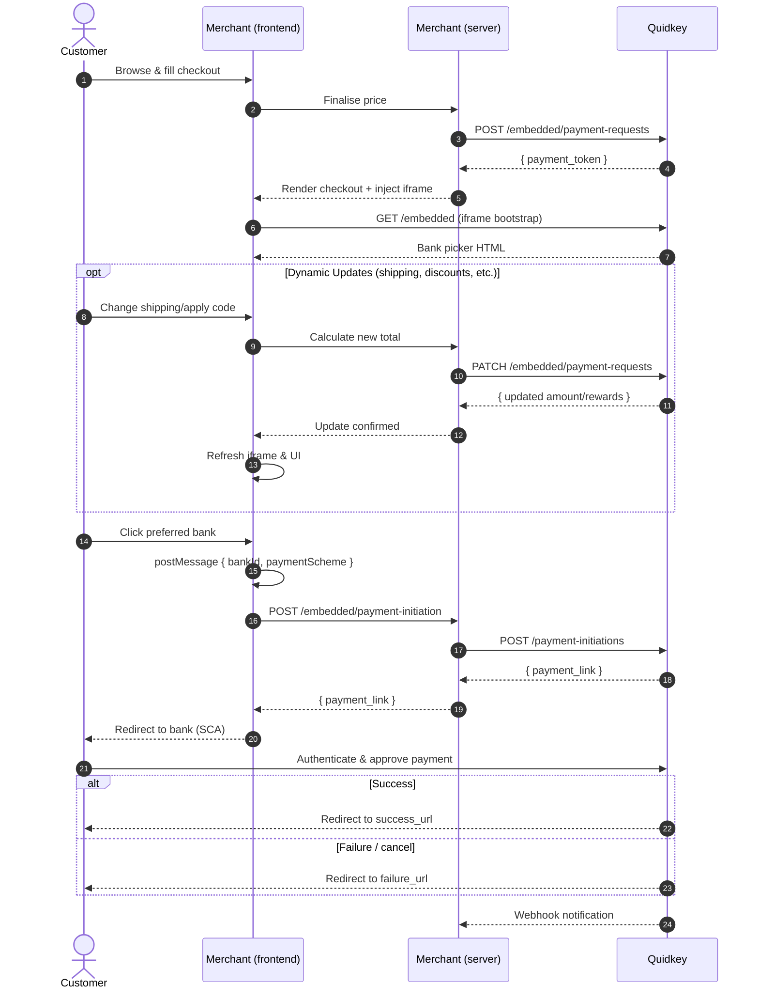

The Embedded Flow adds Quidkey's bank payment option alongside your existing Stripe Payment Element. Customers see both payment methods on your checkout page and choose between card payments (Stripe) or bank transfers (Quidkey) — all without leaving your site.

<Note>
This guide assumes you already have a **Stripe Payment Element** integrated on your checkout page. You're adding Quidkey alongside Stripe, not replacing it.
</Note>

<CardGroup cols={2}>
<Card title="Create a Payment Request" icon="plus" href="/guides/embedded-flow/create">
  Authenticate and create a payment request to get a payment token
</Card>

<Card title="Embed the Checkout" icon="browser" href="/guides/embedded-flow/embed">
  Add the bank selection iframe and wire up Stripe mutual exclusion
</Card>

<Card title="After Payment" icon="chart-line" href="/guides/embedded-flow/after-payment">
  Handle webhooks, verify signatures, and process fees
</Card>

<Card title="API Playground" icon="flask" href="/api-reference/embedded/create-a-payment-request-and-return-a-payment_token-for-iframe-flow">
  Test creating a payment request in your browser — no setup required
</Card>
</CardGroup>

## Prerequisites

- [ ] **Stripe Payment Element already integrated** on your checkout page
- [ ] Quidkey `client_id` and `client_secret` ([sign up](https://merchants.quidkey.com))
- [ ] HTTPS enabled on your checkout page

<Info>
**No Stripe changes required** — your existing Stripe integration stays exactly as it is. You're adding Quidkey alongside, not replacing anything.
</Info>

## When to Use the Embedded Flow

| | **Embedded Flow (with Stripe)** | **Payment Links** |
|---|---|---|
| **Best for** | Merchants with an existing Stripe checkout | Invoicing, ad-hoc payments, no-code scenarios |
| **Integration effort** | Embed iframe, handle postMessage events, route Pay button | One API call to create a link, then share the URL |
| **Customer experience** | Inline checkout on your site (Stripe + Quidkey side by side) | Quidkey-hosted checkout page |
| **Frontend code** | HTML/JavaScript for iframe + Stripe mutual exclusion | None |
| **Use case** | E-commerce with Stripe, subscription platforms | B2B invoices, service payments, cross-border pay-ins |

<Tip>
**Need both?** You can use the Embedded Flow for your checkout page and Payment Links for invoice emails — they share the same backend API and webhook infrastructure.
</Tip>

## How It Works

## Key Features

- **Works alongside Stripe** — Customers choose between card (Stripe) or bank transfer (Quidkey) on the same checkout page
- **Mutual exclusion** — When a customer selects Quidkey, the Stripe Payment Element collapses, and vice versa
- **Bank prediction** — Quidkey automatically predicts and pre-selects the customer's bank
- **Multiple payment schemes** — SEPA, Faster Payments, Multibanco, and more supported automatically
- **Dynamic amounts** — Update the payment amount after creation (e.g., shipping costs, discounts)
- **Dynamic height** — Iframe adjusts height automatically based on available payment methods
- **Rewards** — Optional loyalty rewards displayed to customers during checkout

## Next Steps

<Steps>
<Step title="Create a payment request">
  Follow the [Create a Payment Request](/guides/embedded-flow/create) guide to authenticate and get a payment token.
</Step>

<Step title="Embed the checkout">
  Learn how to [embed the bank selection iframe](/guides/embedded-flow/embed) on your checkout page, including Stripe mutual exclusion.
</Step>

<Step title="Handle post-payment">
  Set up [webhooks and fee processing](/guides/embedded-flow/after-payment) to complete your integration.
</Step>
</Steps>
