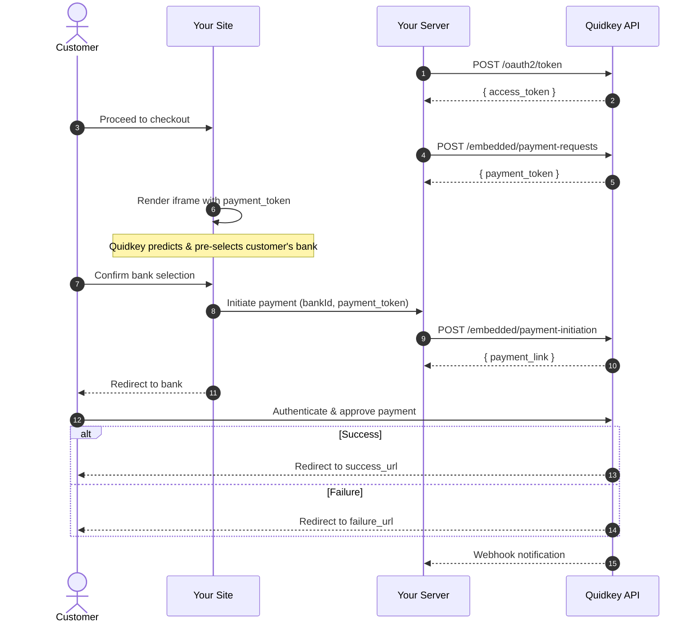

The Embedded Flow lets you add Quidkey's bank payment option directly into your checkout page. Customers select their bank in an iframe on your site, authenticate with their bank, and complete the payment — all without leaving your checkout experience.

<CardGroup cols={2}>
<Card title="Create a Payment Request" icon="plus" href="/guides/embedded-flow/create">
  Authenticate and create a payment request to get a payment token
</Card>

<Card title="Embed the Checkout" icon="browser" href="/guides/embedded-flow/embed">
  Add the bank selection iframe to your checkout page
</Card>

<Card title="After Payment" icon="chart-line" href="/guides/embedded-flow/after-payment">
  Handle webhooks, verify signatures, and process fees
</Card>

<Card title="Stripe Integration" icon="code-merge" href="/guides/embedded-with-stripe">
  Add Quidkey alongside your existing Stripe Payment Element
</Card>
</CardGroup>

## When to Use the Embedded Flow

The Embedded Flow and Payment Links serve different integration needs:

| | **Embedded Flow** | **Payment Links** |
|---|---|---|
| **Best for** | E-commerce checkouts, in-app payments | Invoicing, ad-hoc payments, no-code scenarios |
| **Integration effort** | Embed iframe, handle postMessage events | API call to create link, then share the URL |
| **Customer experience** | Inline checkout on your site | Quidkey-hosted checkout page |
| **Frontend code** | HTML/JavaScript for iframe | None |
| **Use case** | Online stores, subscription platforms | B2B invoices, service payments, cross-border pay-ins |

<Tip>
**Need both?** You can use the Embedded Flow for your checkout page and Payment Links for invoice emails — they share the same backend API and webhook infrastructure.
</Tip>

## How It Works

## Key Features

- **Bank prediction** — Quidkey automatically predicts and pre-selects the customer's bank based on their country and information
- **Inline checkout** — Bank selection happens on your site via iframe, customers never leave your page
- **Multiple payment schemes** — SEPA, Faster Payments, Multibanco, and more supported automatically
- **Dynamic amounts** — Update the payment amount after creation (e.g., shipping costs, discounts)
- **Dynamic height** — Iframe adjusts height automatically based on available payment methods
- **Rewards** — Optional loyalty rewards displayed to customers during checkout
- **Works alongside Stripe** — Add as a payment option next to your existing Stripe Payment Element

## Next Steps

<Steps>
<Step title="Create a payment request">
  Follow the [Create a Payment Request](/guides/embedded-flow/create) guide to authenticate and get a payment token.
</Step>

<Step title="Embed the checkout">
  Learn how to [embed the bank selection iframe](/guides/embedded-flow/embed) on your checkout page.
</Step>

<Step title="Handle post-payment">
  Set up [webhooks and fee processing](/guides/embedded-flow/after-payment) to complete your integration.
</Step>
</Steps>
