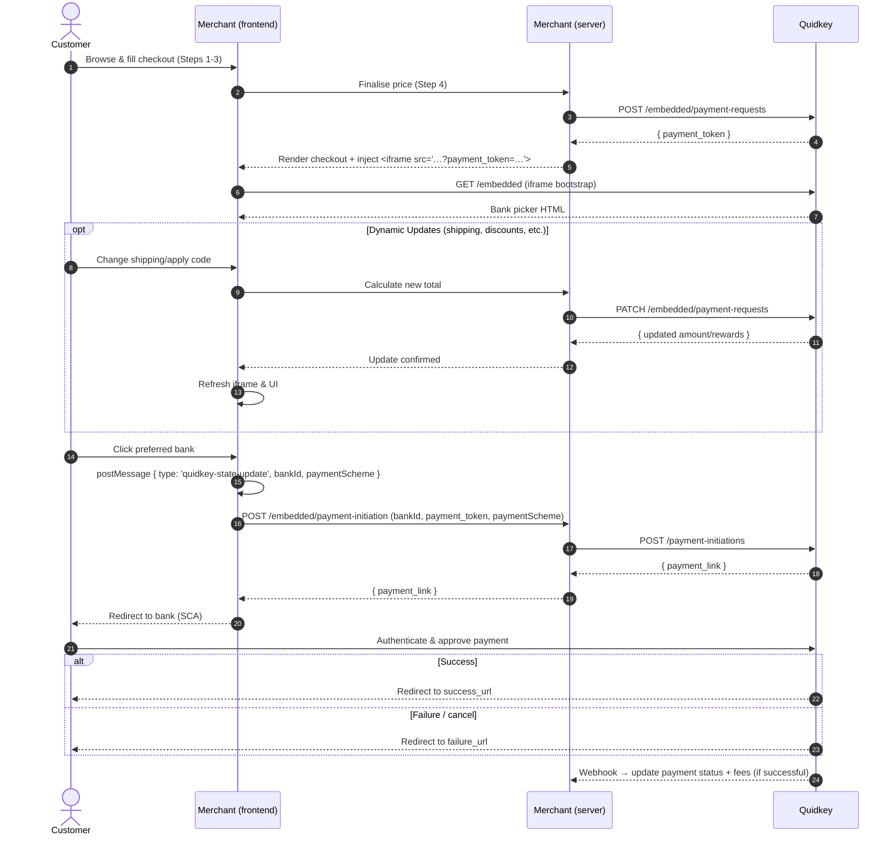

This guide explains how to add the Quidkey open-banking option next to your existing Stripe Payment Element. The customer sees a single payment section where exactly one method (Stripe **or** Quidkey) can be selected at a time.

<Note>
**Fee Processing**: For successful transactions, Quidkey calculates fees automatically and includes detailed fee information in webhook payloads for merchant accounting, billing reconciliation, and cost tracking. Fees are processed in merchant backend systems only and are not displayed to customers.
</Note>

<Info>
**Dynamic Updates**: Payment amounts and rewards can be updated after creation but before the customer initiates payment with their bank. This enables real-time adjustments for shipping costs, discounts, and promotional offers without requiring a new payment token.
</Info>

## Integration Flow



## Backend Changes

### Authenticate Once Per Session

Before you can create the payment request you must exchange the `client_id` / `client_secret` you received from Quidkey for an `access_token`. The token is valid for ~15 minutes and must be sent in the `Authorization: Bearer …` header of every server-to-server call to Quidkey.

<CodeGroup>

```bash cURL
curl -X POST 'https://core.quidkey.com/oauth2/token' \
  -H 'Content-Type: application/json' \
  -d '{
    "client_id": "<your-client-id>",
    "client_secret": "<your-client-secret>"
  }'
```

```javascript Node.js
const response = await fetch('https://core.quidkey.com/oauth2/token', {
  method: 'POST',
  headers: { 'Content-Type': 'application/json' },
  body: JSON.stringify({
    client_id: process.env.QUIDKEY_CLIENT_ID,
    client_secret: process.env.QUIDKEY_CLIENT_SECRET
  })
});

const { access_token, refresh_token, expires_in } = await response.json();
```

```python Python
import requests

response = requests.post(
    'https://core.quidkey.com/oauth2/token',
    json={
        'client_id': os.getenv('QUIDKEY_CLIENT_ID'),
        'client_secret': os.getenv('QUIDKEY_CLIENT_SECRET')
    }
)

data = response.json()
access_token = data['access_token']
```

</CodeGroup>

<Tip>
**What you'll receive:**
- `access_token` – include as `Authorization: Bearer <token>` in subsequent calls
- `refresh_token` – call `/oauth2/refresh` to obtain a new access_token without re-posting credentials
- `expires_in` – token validity in seconds (typically 900 = 15 minutes)

See the [Authentication API reference](/api-reference/auth/issue-a-new-access-token) for complete details and interactive playground.
</Tip>

### Create a Payment Request

Use the bearer token to request a `payment_token`. This call should be made once the customer has locked in the final price at checkout.

<Warning>
Create this request **after** the customer confirms price & options. The token has a 15-minute TTL.
</Warning>

<CodeGroup>

```bash cURL
curl -X POST 'https://core.quidkey.com/embedded/payment-requests' \
  -H 'Authorization: Bearer <access_token>' \
  -H 'Content-Type: application/json' \
  -d '{
    "customer": {
      "name": "Jack Haversham",
      "email": "jack@example.com",
      "phone": "+351960306459",
      "country": "PT"
    },
    "order": {
      "order_id": "ORD-123456",
      "amount": 2550,
      "currency": "EUR",
      "payment_reference": "Order #3451as32",
      "locale": "en-GB",
      "test_transaction": true,
      "rewards": {
        "extra_rewards": 150,
        "total_rewards": 300,
        "description": "Loyalty bonus + base rewards"
      }
    },
    "redirect_urls": {
      "success_url": "https://merchant.com/checkout/success",
      "failure_url": "https://merchant.com/checkout/error"
    }
  }'
```

```javascript Node.js
const response = await fetch('https://core.quidkey.com/embedded/payment-requests', {
  method: 'POST',
  headers: {
    'Authorization': `Bearer ${accessToken}`,
    'Content-Type': 'application/json'
  },
  body: JSON.stringify({
    customer: {
      name: 'Jack Haversham',
      email: 'jack@example.com',
      phone: '+351960306459',
      country: 'PT'
    },
    order: {
      order_id: 'ORD-123456',
      amount: 2550,
      currency: 'EUR',
      payment_reference: 'Order #3451as32',
      locale: 'en-GB',
      test_transaction: true,
      rewards: {
        extra_rewards: 150,
        total_rewards: 300,
        description: 'Loyalty bonus + base rewards'
      }
    },
    redirect_urls: {
      success_url: 'https://merchant.com/checkout/success',
      failure_url: 'https://merchant.com/checkout/error'
    }
  })
});

const { payment_token, expires_in } = await response.json();
```

</CodeGroup>

<Info>
You'll receive a `payment_token` (valid for 15 minutes) to embed in your iframe. See the [Create Payment Request API](/api-reference/embedded/create-payment-request) for the complete specification and response schema.
</Info>

<AccordionGroup>

<Accordion title="Amount Format Explanation">
- `"amount": 2550` represents €25.50 (2550 cents)
- This matches Stripe's format exactly: `stripe.paymentIntents.create({ amount: 2550, currency: 'eur' })`
- Always use integers - never decimals like `25.50`
</Accordion>

<Accordion title="Rewards Explanation">
- `"rewards"` object is optional - include only if you want to offer customer rewards
- `"extra_rewards"`: Reward points for this transaction (required if rewards included)
- `"total_rewards"`: Total points customer will receive (optional)
- `"description"`: Optional text describing the reward offer (max 255 characters)
- Rewards are distributed to customers only on successful payment completion via webhook
- All reward values must be non-negative numbers
</Accordion>

<Accordion title="Rewards Usage Examples">
```json Transaction-specific rewards only
{
  "rewards": {
    "extra_rewards": 150,
    "description": "Bonus for weekend purchase"
  }
}
```

```json Total rewards only (simpler)
{
  "rewards": {
    "total_rewards": 300,
    "description": "Your loyalty rewards"
  }
}
```

```json Both values (full transparency)
{
  "rewards": {
    "extra_rewards": 150,
    "total_rewards": 300,
    "description": "Weekend bonus + base rewards"
  }
}
```
</Accordion>

</AccordionGroup>

### Update a Payment Request (Optional)

After creating a payment request, you can update the amount and/or rewards **before** the customer initiates payment with their bank.

<Info>
**Use Cases**: Dynamic shipping costs, real-time promotions, cart modifications, tax adjustments
</Info>

<CodeGroup>

```bash cURL
curl -X PATCH 'https://core.quidkey.com/embedded/payment-requests' \
  -H 'Authorization: Bearer <access_token>' \
  -H 'Content-Type: application/json' \
  -d '{
    "payment_token": "ptok_efghijklm…",
    "amount": 2750,
    "rewards": {
      "extra_rewards": 200,
      "total_rewards": 400,
      "description": "Flash sale bonus!"
    }
  }'
```

```javascript Node.js
async function updatePaymentWithShipping(paymentToken, shippingCost) {
  const originalAmount = 2550;
  const newAmount = originalAmount + shippingCost;

  const response = await fetch('https://core.quidkey.com/embedded/payment-requests', {
    method: 'PATCH',
    headers: {
      'Authorization': `Bearer ${accessToken}`,
      'Content-Type': 'application/json'
    },
    body: JSON.stringify({
      payment_token: paymentToken,
      amount: newAmount
    })
  });

  return await response.json();
}
```

</CodeGroup>

<Warning>
- Updates allowed only while payment status is `pending`
- Once customer clicks a bank and starts payment, only rewards can be updated
- Amount updates are blocked after payment initiation
</Warning>

### Stripe PaymentIntent

Your existing PaymentIntent creation can stay exactly as it is. As long as you already render a single Stripe Payment Element, no backend changes are required here.

## Front-end Implementation

### Embed the Quidkey iframe

Add the iframe **after** you have received a successful `payment_token` response. If the API call fails, keep the page in its Stripe-only state.

```html
<iframe
  id="quidkey-iframe"
  src="https://core.quidkey.com/embedded?payment_token=<server-side-payment-token>"
  title="Quidkey checkout"
  style="width:100%;height:108px;border:0;overflow:hidden"
  loading="lazy"
></iframe>
```

### Dynamic Height Adjustment

The Quidkey iframe automatically adjusts its height based on the number of available payment methods and whether lists are open.

**Height Calculation:**
- **Base Height**: `payment_method_count × 54px` (includes 1px border per method)
- **Drawer Height**: Additional 263px when bank selection lists are open
- **Standard markets**: 2 payment methods (108px base)
- **Enhanced markets**: 3+ payment methods (162px+ base) - e.g., Multibanco

```javascript
window.addEventListener("message", (event) => {
  if (event.data.type === "quidkey-state-update" && event.data.dynamicHeight) {
    document.documentElement.style.setProperty(
      '--quidkey-dynamic-height',
      event.data.dynamicHeight
    );
  }
});
```

**CSS Setup:**

```css
:root {
  --quidkey-dynamic-height: 108px; /* Default for 2 methods */
}

.quidkey-element-container {
  position: relative;
  overflow: hidden;
  margin-block-end: -2px;
  width: 100%;
  height: var(--quidkey-dynamic-height);
  min-height: var(--quidkey-dynamic-height);
  box-shadow: 0px 0px 1px rgba(0, 0, 0, 0.03), 0px 3px 6px rgba(0, 0, 0, 0.02);
  transition: height 0.35s !important;
}

.quidkey-element-container iframe {
  border: none;
  height: inherit;
  left: 0;
  overflow-clip-margin: 0;
  overflow: hidden;
  position: absolute;
  top: 0;
  width: 100%;
}
```

### Payment Scheme Integration

The Quidkey iframe supports multiple payment schemes (SEPA, Multibanco, Faster Payments, etc.). Portuguese customers will see additional payment methods like Multibanco when available.

```javascript
// Global state tracking
let currentSelection = { source: "quidkey", method: null };
let currentPaymentScheme = null;

// Listen for payment scheme updates from iframe
window.addEventListener("message", (event) => {
  if (
    !quidkeyOrigin ||
    event.origin !== quidkeyOrigin ||
    event.data.type !== "quidkey-state-update"
  ) return;

  // Update dynamic height
  if (event.data.dynamicHeight) {
    document.documentElement.style.setProperty(
      '--quidkey-dynamic-height',
      event.data.dynamicHeight
    );
  }

  // Track payment scheme from iframe
  currentPaymentScheme = event.data.paymentScheme || null;

  // Handle bank selection
  const selectedBankId = event.data.selectedBankId;
  if (selectedBankId) {
    currentSelection = {
      source: "quidkey",
      method: selectedBankId,
    };
    purchaseButton.disabled = false;
  }

  // Close Stripe if Quidkey is active
  if (event.data.isListOpen || event.data.isPredictedBankSelected) {
    if (paymentElement) {
      paymentElement.collapse();
    }
  }
});
```

### Payment Initiation

When the customer clicks Purchase, route to either Stripe or Quidkey based on their selection.

<CodeGroup>

```javascript Quidkey Flow
if (currentSelection.source === "quidkey") {
  const response = await fetch("/quidkey/payment-initiation", {
    method: "POST",
    headers: { "Content-Type": "application/json" },
    body: JSON.stringify({
      bankId: currentSelection.method,
      paymentToken: quidkeyPaymentToken,
      paymentScheme: currentPaymentScheme // null = default, "MULTIBANCO" = user choice
    }),
  });

  const result = await response.json();
  if (result.success && result.payment_link) {
    window.location.href = result.payment_link; // Redirect to bank
  }
}
```

```javascript Stripe Flow
if (currentSelection.source === "stripe") {
  const { error } = await stripe.confirmPayment({
    elements,
    confirmParams: {
      return_url: `${window.location.origin}/success.html`,
    },
  });

  if (error) {
    console.error(error.message);
  }
}
```

</CodeGroup>

**Backend Payment Initiation:**

```javascript
// Backend endpoint
app.post('/quidkey/payment-initiation', async (req, res) => {
  const { bankId, paymentToken, paymentScheme } = req.body;

  const result = await fetch('https://core.quidkey.com/embedded/payment-initiation', {
    method: 'POST',
    headers: {
      'Authorization': `Bearer ${accessToken}`,
      'Content-Type': 'application/json'
    },
    body: JSON.stringify({
      bankId,
      paymentScheme: paymentScheme || null
    })
  });

  const data = await result.json();
  res.json(data);
});
```

<Tip>
**Payment Scheme Values:**
- `null` or `undefined` → Use default scheme for customer's country
- `"MULTIBANCO"` → User explicitly selected Multibanco
- `"SEPA_CREDIT_TRANSFER"` → User explicitly selected SEPA
- Future schemes like `"PIX"`, `"UPI"` will work automatically
</Tip>

### Reference Implementation

A complete, working implementation is maintained in an open-source repository. It is the canonical reference and always tracks the latest Quidkey API changes.

<CardGroup cols={2}>

<Card title="Live Demo" icon="browser" href="https://stripe-335796202879.europe-west1.run.app/">
  Try the integration in action with test credentials
</Card>

<Card title="Source Code" icon="github" href="https://github.com/Banqzinc/stripe-sample-code">
  Complete implementation with Stripe + Quidkey
</Card>

</CardGroup>

**Key files to explore:**

- **[checkout.html](https://github.com/Banqzinc/stripe-sample-code/blob/main/public/checkout.html)** – Hosts the Stripe Payment Element and embeds the Quidkey iframe
- **[client.js](https://github.com/Banqzinc/stripe-sample-code/blob/main/src/client.js)** – Obtains bearer token, creates payment request, initiates payment
- **[paymentInitiation.js](https://github.com/Banqzinc/stripe-sample-code/blob/main/src/controllers/paymentInitiation.js)** – Express route that calls Quidkey's payment initiation endpoint
- **[createCheckoutSession.js](https://github.com/Banqzinc/stripe-sample-code/blob/main/src/controllers/createCheckoutSession.js)** – Creates Stripe PaymentIntent and returns both `clientSecret` and `payment_token`

<Check>
Copy-pasting is intentionally omitted here – refer to the repository above so you always get the latest, tested version.
</Check>

## Webhook Delivery

Once the customer finishes Strong Customer Authentication, Quidkey delivers the final payment status to **your** backend via an HTTPS webhook.

### Register & Obtain a Signing Secret

<Steps>

<Step title="Register your webhook URL">
  ```bash
  POST https://core.quidkey.com/webhooks
  Authorization: Bearer <access_token>
  Content-Type: application/json

  {
    "webhook_url": "https://api.merchant.com/webhooks/quidkey"
  }
  ```

  The response echoes the URL together with a confirmation message.
</Step>

<Step title="Generate the signing secret">
  ```bash
  POST https://core.quidkey.com/webhooks/secret
  Authorization: Bearer <access_token>
  ```

  <Warning>
  The secret is returned in the response and shown **once** – store it safely in a secure vault (AWS Secrets Manager, HashiCorp Vault, etc.).
  </Warning>

  <Tip>
  See the [Generate Webhook Secret API](/api-reference/webhooks/generate-webhook-secret) for complete details and to test in the interactive playground.
  </Tip>
</Step>

<Step title="Revoke the secret (if needed)">
  Roll or revoke the secret during incident response:

  ```bash
  POST https://core.quidkey.com/webhooks/secret/revoke
  Authorization: Bearer <access_token>
  ```
</Step>

</Steps>

### Payload Structure

We send a Stripe-style envelope so that existing tooling can be reused.

```json Webhook Payload
{
  "id": "evt_28b2d68f",
  "object": "event",
  "created": 1716148300,
  "type": "quidkey.payment_request.succeeded",
  "data": {
    "object": {
      "id": "pr_782516093",
      "amount": 2550,
      "currency": "EUR",
      "status": "succeeded",
      "test": true,
      "metadata": {
        "order_id": "ORD-123",
        "payment_token": "ptok_…"
      },
      "fees": {
        "total_fees": 2.50,
        "fees_currency": "EUR",
        "fees_breakdown": [
          {
            "id": "fee_percentage_123",
            "type": "percentage",
            "amount": 1.50,
            "currency": "EUR",
            "rate_type": "domestic_percent_fee",
            "rate_value": 1.5,
            "notes": "1.5% fee on 25.50 EUR"
          }
        ]
      }
    }
  }
}
```

<Note>
**Fee Information**: Only included for successful payments (`status: "succeeded"`). Failed or cancelled payments do not include fees.
</Note>

### HTTP Headers

| Header           | Purpose                                  |
|------------------|------------------------------------------|
| `X-Signature`    | `t=<unix-ts>,v1=<hex-hmac>`             |
| `X-Timestamp`    | Unix epoch seconds                       |
| `X-Client-Id`    | Your `client_id`                         |

The HMAC is SHA-256 over `"${timestamp}.${raw_body}"`, keyed by your **webhook signing secret**.

### Verifying Signatures

The `X-Signature` header lets you confirm that the webhook really came from Quidkey and that the payload was not tampered with in transit.

<Tabs>

<Tab title="Using Stripe Helper">
```typescript
const sig = req.get('x-signature');
const event = stripe.webhooks.constructEvent(
  req.rawBody,
  sig,
  process.env.QUIDKEY_WEBHOOK_SECRET
);
```
</Tab>

<Tab title="Custom Implementation">
```typescript
import crypto from 'crypto';

function verify(rawBody: Buffer, header: string, secret: string) {
  const [, ts, v1] = header.match(/^t=(\d+),v1=(.+)$/) || [];
  const hmac = crypto
    .createHmac('sha256', secret)
    .update(`${ts}.${rawBody}`)
    .digest('hex');

  if (hmac !== v1) throw new Error('Invalid signature');
  // optional: check tolerance (5 min)
}
```
</Tab>

</Tabs>

### Process Webhook Events

```typescript
app.post('/webhooks/quidkey', (req, res) => {
  const event = stripe.webhooks.constructEvent(
    req.body,
    req.headers['x-signature'],
    webhookSecret
  );

  if (event.type === 'quidkey.payment_request.succeeded') {
    const payment = event.data.object;

    // Store payment details
    await updatePayment(payment.metadata.order_id, {
      status: payment.status,
      amount: payment.amount,
      currency: payment.currency
    });

    // Process fee information if present
    if (payment.fees) {
      await storeFeeInformation({
        orderId: payment.metadata.order_id,
        totalFees: payment.fees.total_fees,
        feesCurrency: payment.fees.fees_currency,
        feeBreakdown: payment.fees.fees_breakdown
      });
    }

    // Process reward information if present
    if (payment.rewards) {
      await distributeRewards({
        orderId: payment.metadata.order_id,
        extraRewards: payment.rewards.extra_rewards,
        totalRewards: payment.rewards.total_rewards
      });
    }
  }

  res.status(200).send('OK');
});
```

<Info>
**Retry Behavior**: Quidkey retries for up to **3 days** with exponential back-off until your endpoint returns any `2xx` status. Events may be delivered out of order or duplicated; de-duplicate using the top-level `id` field.
</Info>

## Fee Handling

### Fee Structure

Quidkey automatically calculates and applies fees for successful transactions. Fee information is included in webhook payloads for merchant accounting and billing reconciliation.

**Fee Types:**
- **Percentage fees**: Based on transaction amount (e.g., 1.5% of €100 = €1.50)
- **Fixed fees**: Flat rate per transaction (e.g., €1.00 per transaction)
- **Currency-specific**: Fees are calculated in the same currency as the transaction

### When Fees Are Applied

| Transaction Status | Fee Calculation | Webhook Includes Fees |
|-------------------|-----------------|----------------------|
| `succeeded` | ✅ Calculated | ✅ Yes |
| `failed` | ❌ No fees | ❌ No |
| `cancelled` | ❌ No fees | ❌ No |
| `pending` | ⏳ Not yet | ❌ No |

<Check>
Fees are only calculated and charged for successful payments where money has actually been transferred.
</Check>

### Fee Breakdown Structure

Each fee in the `fees_breakdown` array contains:

```json
{
  "id": "fee_unique_identifier",
  "type": "percentage" | "fixed",
  "amount": 1.50,
  "currency": "EUR",
  "rate_type": "domestic_percent_fee",
  "rate_value": 1.5,
  "notes": "1.5% fee on 25.50 EUR"
}
```

## QA Checklist Before Going Live

<AccordionGroup>

<Accordion title="Security & Configuration">
- [ ] Serve checkout over HTTPS (wallets such as Apple Pay require it)
- [ ] Use live Stripe keys in production mode
- [ ] Ask Quidkey for your production merchant_id and iframe URL
- [ ] Store webhook secret in secure vault
</Accordion>

<Accordion title="User Experience">
- [ ] Verify that only one method can be selected at any time
- [ ] Confirm Purchase button enables/disables correctly
- [ ] Test post-purchase redirect flows for both Stripe and Quidkey paths
- [ ] Verify dynamic height adjustments work smoothly
</Accordion>

<Accordion title="Payment Updates">
- [ ] Verify amount updates work before payment initiation
- [ ] Confirm updates are blocked after customer selects a bank
- [ ] Test error handling for expired tokens
- [ ] Ensure iframe refreshes correctly after updates
- [ ] Test shipping cost calculations
- [ ] Test discount code applications
- [ ] Test multiple rapid updates
</Accordion>

<Accordion title="Fee & Webhook Processing">
- [ ] Test fee processing: Verify successful payments include fee information
- [ ] Test fee storage: Ensure your system correctly stores fee breakdown data
- [ ] Verify webhook signature validation works
- [ ] Test webhook retry and idempotency handling
</Accordion>

</AccordionGroup>

## Support

Questions? Ping us on your shared Slack channel or email [rabea@quidkey.com](mailto:rabea@quidkey.com) – we usually reply within one business day.
