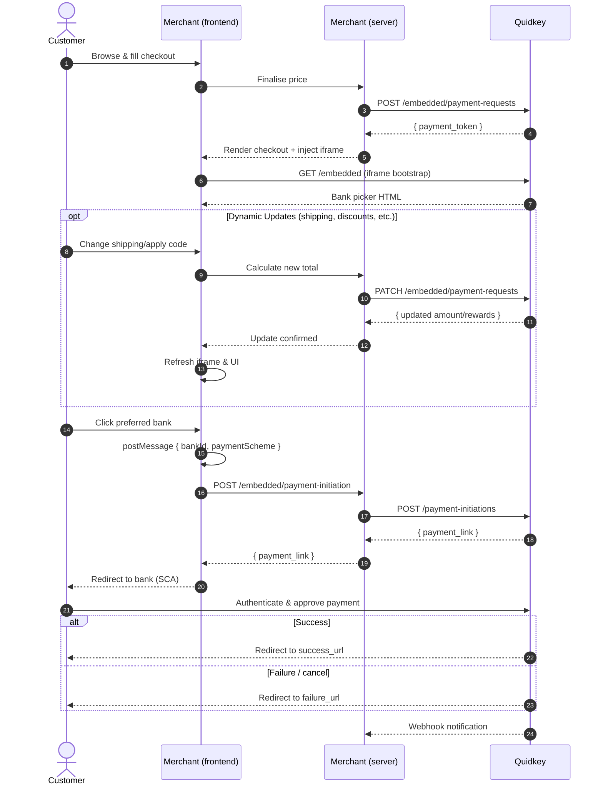

This guide explains how to add Quidkey as a bank payment option next to your existing Stripe Payment Element. The customer sees a single payment section where exactly one method (Stripe **or** Quidkey) can be selected at a time.

<Note>
**New to Quidkey?** Start with the [Embedded Flow overview](/guides/embedded-flow/overview) for the general integration guide, or the [Quickstart](/quickstart) to choose the right path for your use case.
</Note>

## Prerequisites

- [ ] Stripe Payment Element already integrated
- [ ] Quidkey `client_id` and `client_secret` ([sign up](https://merchants.quidkey.com))
- [ ] HTTPS enabled on your checkout page

<Info>
**No Stripe changes required** — your existing Stripe integration stays exactly as it is. You're adding Quidkey alongside, not replacing anything.
</Info>

## Integration Flow


```mermaid
sequenceDiagram
    autonumber
    actor Customer
    participant Merchant as Merchant (frontend)
    participant Backend as Merchant (server)
    participant Quidkey
    Customer->>Merchant: Browse & fill checkout
    Merchant->>Backend: Finalise price
    Backend->>Quidkey: POST /embedded/payment-requests
    Quidkey-->>Backend: { payment_token }
    Backend-->>Merchant: Render checkout + inject iframe
    Merchant->>Quidkey: GET /embedded (iframe bootstrap)
    Quidkey-->>Merchant: Bank picker HTML
    opt Dynamic Updates (shipping, discounts, etc.)
        Customer->>Merchant: Change shipping/apply code
        Merchant->>Backend: Calculate new total
        Backend->>Quidkey: PATCH /embedded/payment-requests
        Quidkey-->>Backend: { updated amount/rewards }
        Backend-->>Merchant: Update confirmed
        Merchant->>Merchant: Refresh iframe & UI
    end
    Customer->>Merchant: Click preferred bank
    Merchant->>Merchant: postMessage { bankId, paymentScheme }
    Merchant->>Backend: POST /embedded/payment-initiation
    Backend->>Quidkey: POST /payment-initiations
    Quidkey-->>Backend: { payment_link }
    Backend-->>Merchant: { payment_link }
    Merchant-->>Customer: Redirect to bank (SCA)
    Customer->>Quidkey: Authenticate & approve payment
    alt Success
        Quidkey-->>Customer: Redirect to success_url
    else Failure / cancel
        Quidkey-->>Customer: Redirect to failure_url
    end
    Quidkey-->>Backend: Webhook notification
```

## Backend Setup

For authentication, creating a payment request, and updating amounts, follow the standard Embedded Flow guides:

<CardGroup cols={2}>
<Card title="Create a Payment Request" icon="plus" href="/guides/embedded-flow/create">
  Authenticate and create a payment token (same for all Embedded Flow integrations)
</Card>

<Card title="API Playground" icon="flask" href="/api-reference/embedded/create-a-payment-request-and-return-a-payment_token-for-iframe-flow">
  Test creating a payment request in your browser — no setup required
</Card>
</CardGroup>

### Stripe PaymentIntent

Your existing PaymentIntent creation stays exactly as it is. As long as you already render a single Stripe Payment Element, no backend changes are required.

## Frontend: Mutual Exclusion

The key Stripe-specific behavior is ensuring only one payment method (Stripe or Quidkey) is active at a time. When the customer interacts with Quidkey's bank picker, collapse the Stripe Payment Element, and vice versa.

### State Tracking

```javascript
// Track which payment method is currently selected
let currentSelection = { source: null, method: null };
let currentPaymentScheme = null;
```

### Collapse Stripe When Quidkey is Active

When the customer selects a bank in the Quidkey iframe, collapse the Stripe Payment Element so only one method is visually active.

```javascript
window.addEventListener('message', (event) => {
  if (event.data.type !== 'quidkey-state-update') return;

  // Update dynamic height (see Embed guide for CSS setup)
  if (event.data.dynamicHeight) {
    document.documentElement.style.setProperty(
      '--quidkey-dynamic-height',
      event.data.dynamicHeight
    );
  }

  // Track payment scheme
  currentPaymentScheme = event.data.paymentScheme || null;

  // Handle bank selection
  const selectedBankId = event.data.selectedBankId;
  if (selectedBankId) {
    currentSelection = { source: 'quidkey', method: selectedBankId };
    purchaseButton.disabled = false;
  }

  // Collapse Stripe when Quidkey is active
  if (event.data.isListOpen || event.data.isPredictedBankSelected) {
    if (paymentElement) {
      paymentElement.collapse();
    }
  }
});
```

<Tip>
For the full iframe setup including dynamic height CSS and postMessage field reference, see [Embed the Checkout](/guides/embedded-flow/embed).
</Tip>

### Route Purchase Button

When the customer clicks Purchase, route to either Stripe or Quidkey based on their current selection.

<CodeGroup>

```javascript Quidkey Path
if (currentSelection.source === 'quidkey') {
  const response = await fetch('/api/quidkey/initiate', {
    method: 'POST',
    headers: { 'Content-Type': 'application/json' },
    body: JSON.stringify({
      bankId: currentSelection.method,
      paymentToken: quidkeyPaymentToken,
      paymentScheme: currentPaymentScheme
    }),
  });

  const result = await response.json();
  if (result.success && result.payment_link) {
    window.location.href = result.payment_link; // Redirect to bank
  }
}
```

```javascript Stripe Path
if (currentSelection.source === 'stripe') {
  const { error } = await stripe.confirmPayment({
    elements,
    confirmParams: {
      return_url: `${window.location.origin}/success.html`,
    },
  });

  if (error) {
    console.error(error.message);
  }
}
```

</CodeGroup>

## Reference Implementation

<CardGroup cols={2}>
<Card title="Live Demo" icon="browser" href="https://embedded.quidkey.com">
  Try the full Stripe + Quidkey integration with test credentials
</Card>

<Card title="Embed the Checkout" icon="browser" href="/guides/embedded-flow/embed">
  Generic iframe setup, height adjustment, and payment initiation
</Card>
</CardGroup>

## After Payment

For webhook setup, signature verification, fee handling, and the production QA checklist, see the shared After Payment guide:

<Card title="After Payment" icon="chart-line" href="/guides/embedded-flow/after-payment">
  Webhooks, fee processing, and QA checklist before going live
</Card>

## Support

Questions? Email [rabea@quidkey.com](mailto:rabea@quidkey.com) — we typically respond within one business day.
