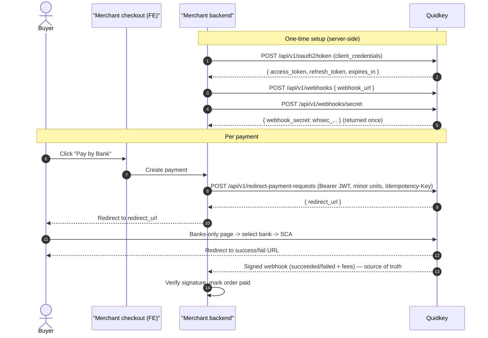

The Redirect flow adds Quidkey's **Pay by Bank** option to a custom checkout that already runs
on top of Stripe Checkout Sessions (or any redirect-based checkout). Your backend creates a
payment with the order + buyer details it already holds, gets back a **`redirect_url`**, and sends
the buyer to a Quidkey-hosted page that shows **only the bank picker**. The buyer authenticates
(SCA) and is returned to your site. The authoritative result arrives via a signed webhook that
**Stripe's own SDK can verify out of the box**.

<Note>
Quidkey sits **alongside** your checkout, not inside it. There is no iframe — you send amounts in
the same integer-minor-unit format as Stripe and verify the webhook with
`stripe.webhooks.constructEvent`. No custom verification code required.
</Note>

<CardGroup cols={2}>
<Card title="Create a Payment" icon="plus" href="/guides/pay-by-bank/create">
  Authenticate, then create a redirect payment and get a `redirect_url`
</Card>

<Card title="After Payment" icon="chart-line" href="/guides/pay-by-bank/after-payment">
  Verify the Stripe-compatible webhook, handle the full event catalog, reconcile status
</Card>
</CardGroup>

## Prerequisites

- [ ] Quidkey `client_id` and `client_secret` ([sign up](https://console.quidkey.com))
- [ ] A server-side backend (the create call must never run client-side)
- [ ] A registered webhook URL + signing secret (see [After Payment](/guides/pay-by-bank/after-payment))

## When to Use the Redirect Flow

| | **Pay by Bank (Redirect)** | **Embedded Flow (with Stripe)** | **Hosted Checkout** |
|---|---|---|---|
| **Best for** | Custom / Stripe-Checkout-style sites that redirect | Sites with an inline Stripe Payment Element | Invoicing, ad-hoc, no-code |
| **Frontend code** | A "Pay by Bank" button + a redirect | iframe + postMessage + Stripe mutual exclusion | None |
| **Amount units** | **Integer minor units** (`1999` = £19.99) | Integer minor units | Integer minor units |
| **Buyer details** | Supplied by your backend at create time | Supplied at create time | Collected on the hosted page |

<Tip>
The Redirect flow uses the **same OAuth, webhook, and bank infrastructure** as the Embedded Flow —
only the buyer-facing surface differs (a hosted banks-only page instead of an iframe).
</Tip>

## How It Works

## Key Properties

- **API-only create**: server-to-server, `protected` + `PAYMENT_REQUESTS_CREATE`. Never expose `client_secret` client-side.
- **Stripe-aligned amounts**: integer minor units in, so there is no decimal/`×100` conversion to get wrong.
- **`redirect_url` is a bearer capability**: it is unauthenticated and keyed by an unguessable id — treat it as a short-lived secret; don't log or share it.
- **Idempotent create**: send an `Idempotency-Key` header so a retried create replays the original response instead of creating a second payment.
- **Webhook is authoritative**: the redirect back to your site is a convenience; always confirm via the webhook.

## Next Steps

<Steps>
<Step title="Create a payment">
  Follow [Create a Payment](/guides/pay-by-bank/create) to authenticate and get a `redirect_url`.
</Step>
<Step title="Handle post-payment">
  Set up [webhooks and verification](/guides/pay-by-bank/after-payment) to complete the integration.
</Step>
</Steps>
