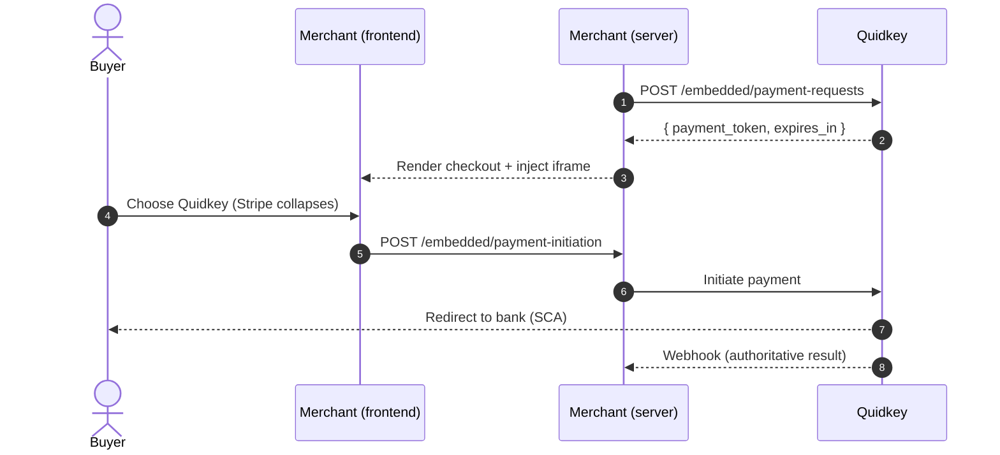

The Embedded flow puts Quidkey's bank payment option right next to your Stripe Payment Element. Buyers see both methods on your checkout page and choose between card (Stripe) and bank transfer (Quidkey), all without leaving your site. When the buyer picks one method, the other collapses, so there's never any ambiguity about how they're paying.

<Note>
This flow assumes you already run a **Stripe Payment Element** on your checkout. You're adding Quidkey alongside it, not replacing it. No changes to your Stripe code are required.
</Note>

<Note>
**Amounts are integer minor units.** `2550` = €25.50, the same format Stripe uses, so your existing amount handling carries over unchanged. See [Amounts & Currencies](/guides/payment-api/concepts/amounts-and-currencies).
</Note>

## How It Works

You create a payment request from your backend to get a short-lived `payment_token`, render the Quidkey iframe with that token next to your Stripe element, and wire up mutual exclusion so only one method is active at a time. When the buyer initiates payment, they're sent to their bank to approve, and Quidkey confirms the result via webhook.



## Create a Payment Request

Call `POST /api/v1/embedded/payment-requests` once the buyer has confirmed the final price. You get back a `payment_token` (valid for 15 minutes) to render in the iframe.

<CodeGroup>

```bash cURL
curl -X POST 'https://core.quidkey.com/api/v1/embedded/payment-requests' \
  -H 'Authorization: Bearer YOUR_ACCESS_TOKEN' \
  -H 'Content-Type: application/json' \
  -d '{
    "customer": {
      "name": "John Doe",
      "email": "john@example.com",
      "phone": "+4917646793347",
      "country": "DE"
    },
    "order": {
      "order_id": "ORD-123456",
      "amount": 2550,
      "currency": "EUR",
      "payment_reference": "Order #3451",
      "locale": "en-GB",
      "test_transaction": true
    },
    "redirect_urls": {
      "success_url": "https://yoursite.com/success",
      "failure_url": "https://yoursite.com/failure"
    }
  }'
```

```javascript Node.js
const response = await fetch('https://core.quidkey.com/api/v1/embedded/payment-requests', {
  method: 'POST',
  headers: {
    'Authorization': `Bearer ${accessToken}`,
    'Content-Type': 'application/json'
  },
  body: JSON.stringify({
    customer: {
      name: 'John Doe',
      email: 'john@example.com',
      phone: '+4917646793347',
      country: 'DE'
    },
    order: {
      order_id: 'ORD-123456',
      amount: 2550,           // €25.50 in minor units
      currency: 'EUR',
      payment_reference: 'Order #3451',
      locale: 'en-GB',
      test_transaction: true
    },
    redirect_urls: {
      success_url: 'https://yoursite.com/success',
      failure_url: 'https://yoursite.com/failure'
    }
  })
});

const { payment_token, expires_in } = await response.json();
```

```python Python
import requests

response = requests.post(
    'https://core.quidkey.com/api/v1/embedded/payment-requests',
    headers={'Authorization': f'Bearer {access_token}'},
    json={
        'customer': {
            'name': 'John Doe',
            'email': 'john@example.com',
            'phone': '+4917646793347',
            'country': 'DE'
        },
        'order': {
            'order_id': 'ORD-123456',
            'amount': 2550,         # €25.50 in minor units
            'currency': 'EUR',
            'payment_reference': 'Order #3451',
            'locale': 'en-GB',
            'test_transaction': True
        },
        'redirect_urls': {
            'success_url': 'https://yoursite.com/success',
            'failure_url': 'https://yoursite.com/failure'
        }
    }
)

data = response.json()
payment_token = data['payment_token']
```

</CodeGroup>

<Check>
You'll receive a `payment_token` and `expires_in`. Use the token to render the bank selection iframe.
</Check>

<Tip>
Need to change the total after creating the request, for shipping or a discount code? Call `PATCH /api/v1/embedded/payment-requests` to update the amount or rewards before the buyer initiates payment. The full guide covers this in detail.
</Tip>

## Full Integration Guide

This page is a quick orientation. Embedding the iframe, wiring up Stripe mutual exclusion, handling `postMessage` events, calling `POST /api/v1/embedded/payment-initiation`, and processing webhooks are all covered step by step in the dedicated Embedded Flow guide.

<CardGroup cols={2}>
<Card title="Embedded Flow Overview" icon="credit-card" href="/guides/embedded-flow/overview">
  The complete walkthrough: create, embed, mutual exclusion, and after-payment
</Card>

<Card title="Create a Payment Request" icon="plus" href="/guides/embedded-flow/create">
  Authenticate, create the token, and update the amount or rewards
</Card>

<Card title="Embed the Checkout" icon="browser" href="/guides/embedded-flow/embed">
  Add the iframe and wire up Stripe mutual exclusion
</Card>

<Card title="After Payment" icon="webhook" href="/guides/embedded-flow/after-payment">
  Handle webhooks, verify signatures, and process fees
</Card>
</CardGroup>

## Other Ways to Accept a Payment

<CardGroup cols={2}>
<Card title="Redirect (Pay by Bank)" icon="arrow-up-right-from-square" href="/guides/payment-api/accept-a-payment/redirect">
  No frontend checkout to build: create a payment and redirect the buyer
</Card>

<Card title="Hosted Checkout" icon="link" href="/guides/payment-api/accept-a-payment/hosted-checkout">
  Share a checkout link, no frontend code at all
</Card>
</CardGroup>
