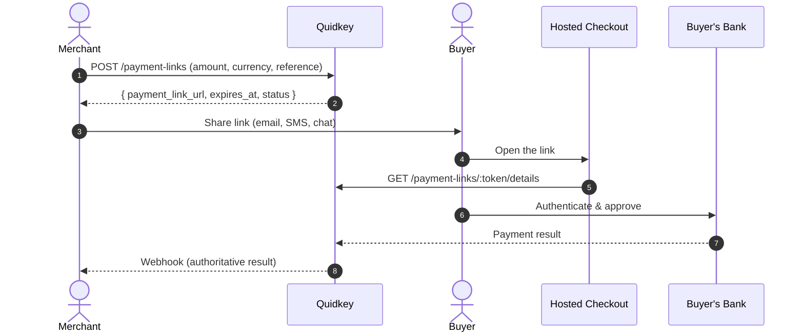

Hosted Checkout lets you collect a bank payment without building any checkout UI. Create a payment link from your backend, share the URL with your buyer over email, SMS, or any messaging channel, and Quidkey hosts the entire checkout page. It's ideal for invoicing, ad-hoc payments, and no-code scenarios.

<Note>
**Amounts are integer minor units.** `5000` = €50.00, the same format used across the Payment API and by Stripe. See [Amounts & Currencies](/guides/payment-api/concepts/amounts-and-currencies).
</Note>

## How It Works

You create a link with one API call and get back a `payment_link_url`. Share it however you like. When the buyer opens the link, Quidkey shows a hosted checkout page where they enter their details, pick their bank, and approve the payment. Your backend learns the result via webhook.



## Create a Checkout Link

Call `POST /api/v1/payment-links` with the payment details. You get back a `payment_link_url` to share, along with `expires_at` and the link `status`.

<CodeGroup>

```bash cURL
curl -X POST 'https://core.quidkey.com/api/v1/payment-links' \
  -H 'Authorization: Bearer YOUR_ACCESS_TOKEN' \
  -H 'Content-Type: application/json' \
  -d '{
    "order": {
      "amount": 5000,
      "currency": "EUR",
      "payment_reference": "INV-2024-001"
    }
  }'
```

```javascript Node.js
const response = await fetch('https://core.quidkey.com/api/v1/payment-links', {
  method: 'POST',
  headers: {
    'Authorization': `Bearer ${accessToken}`,
    'Content-Type': 'application/json'
  },
  body: JSON.stringify({
    order: {
      amount: 5000,           // €50.00 in minor units
      currency: 'EUR',
      payment_reference: 'INV-2024-001'
    }
  })
});

const { data } = await response.json();
console.log('Payment link URL:', data.payment_link_url);
console.log('Expires at:', data.expires_at);
console.log('Status:', data.status);
```

```python Python
import requests

response = requests.post(
    'https://core.quidkey.com/api/v1/payment-links',
    headers={'Authorization': f'Bearer {access_token}'},
    json={
        'order': {
            'amount': 5000,         # €50.00 in minor units
            'currency': 'EUR',
            'payment_reference': 'INV-2024-001'
        }
    }
)

data = response.json()['data']
print('Payment link URL:', data['payment_link_url'])
print('Expires at:', data['expires_at'])
print('Status:', data['status'])
```

</CodeGroup>

```json Response
{
  "success": true,
  "data": {
    "payment_link_url": "https://core.quidkey.com/payment-link/a1b2c3d4e5f6...",
    "expires_at": "2024-04-07T12:00:00.000Z",
    "status": "active"
  }
}
```

<Check>
Save the `payment_link_url`. This is the URL you'll share with your buyer. The token in the URL is only returned once, at creation time.
</Check>

<Tip>
Under the hood, the hosted page reads the link via the public `GET /api/v1/payment-links/:token/details` and completes payment with `POST /api/v1/payment-links/:token/confirm`. You don't call these yourself: Quidkey's checkout page handles them.
</Tip>

## Full Integration Guide

This page is a quick orientation. Sharing strategies, the checkout experience, custom redirect URLs, link expiry, single-use versus reusable links, and webhooks are all covered in the dedicated Hosted Checkout guide.

<CardGroup cols={2}>
<Card title="Hosted Checkout Overview" icon="link" href="/guides/payment-links/overview">
  The complete walkthrough, including the link lifecycle
</Card>

<Card title="Create a Checkout Link" icon="plus" href="/guides/payment-links/create">
  Full request reference, custom redirect URLs, and link expiry
</Card>

<Card title="Checkout Experience" icon="browser" href="/guides/payment-links/checkout-experience">
  See what your buyers see when they open a link
</Card>

<Card title="After Payment" icon="webhook" href="/guides/payment-links/after-payment">
  Track status, handle webhooks, and manage your links
</Card>
</CardGroup>

## Other Ways to Accept a Payment

<CardGroup cols={2}>
<Card title="Redirect (Pay by Bank)" icon="arrow-up-right-from-square" href="/guides/payment-api/accept-a-payment/redirect">
  Create a payment and redirect the buyer to a Quidkey-hosted bank page
</Card>

<Card title="Embedded (with Stripe)" icon="credit-card" href="/guides/payment-api/accept-a-payment/embedded">
  Add Quidkey inline alongside your Stripe Payment Element
</Card>
</CardGroup>
