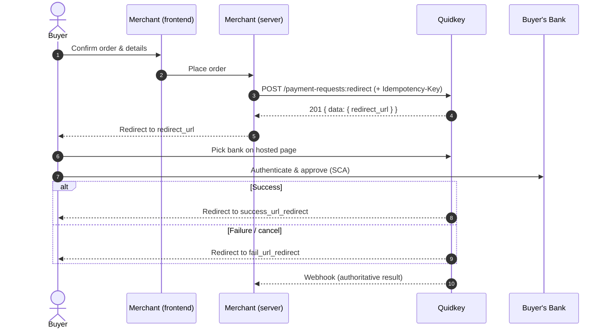

Collect the buyer's details on your own site, create a payment from your backend, and send the buyer to a Quidkey-hosted page to pick their bank and approve. No iframe and no checkout UI to build: one API call and a redirect.

<Note>
**Amounts are integer minor units.** `2550` = £25.50, `1000` = €10.00. The same format is used across the Payment API. See [Amounts & Currencies](/guides/payment-api/concepts/amounts-and-currencies).
</Note>

## How It Works



## Prerequisites

- A Quidkey merchant account with `client_id` and `client_secret` ([sign up](https://console.quidkey.com))
- An access token (see [Authentication](/guides/payment-api/concepts/authentication))
- The buyer's name, email, phone number, and billing address

## Step 1: Authenticate

Exchange your credentials for an access token. The token is valid for 15 minutes.

<CodeGroup>

```bash cURL
curl -X POST 'https://core.quidkey.com/api/v1/oauth2/token' \
  -H 'Content-Type: application/json' \
  -d '{
    "client_id": "your-client-id",
    "client_secret": "your-client-secret"
  }'
```

```javascript Node.js
const response = await fetch('https://core.quidkey.com/api/v1/oauth2/token', {
  method: 'POST',
  headers: { 'Content-Type': 'application/json' },
  body: JSON.stringify({
    client_id: process.env.QUIDKEY_CLIENT_ID,
    client_secret: process.env.QUIDKEY_CLIENT_SECRET
  })
});

const { data } = await response.json();
const accessToken = data.access_token;
```

```python Python
import os, requests

response = requests.post(
    'https://core.quidkey.com/api/v1/oauth2/token',
    json={
        'client_id': os.getenv('QUIDKEY_CLIENT_ID'),
        'client_secret': os.getenv('QUIDKEY_CLIENT_SECRET')
    }
)

data = response.json()['data']
access_token = data['access_token']
```

</CodeGroup>

<Tip>
See the [Authentication API reference](/api-reference/endpoint/issue-token) for the full token lifecycle and an interactive playground.
</Tip>

## Step 2: Create a Redirect Payment

Call `POST /api/v1/payment-requests:redirect` with a Bearer token and an `Idempotency-Key`. The request body carries the buyer, the billing address, the amount, and where to send the buyer afterwards.

<CodeGroup>

```bash cURL
curl -X POST 'https://core.quidkey.com/api/v1/payment-requests:redirect' \
  -H 'Authorization: Bearer YOUR_ACCESS_TOKEN' \
  -H 'Idempotency-Key: order-1001-attempt-1' \
  -H 'Content-Type: application/json' \
  -d '{
    "merchant_id": "your-merchant-id",
    "customer": {
      "name": "Jane Buyer",
      "email": "jane@example.com",
      "phone_number": "+447700900123"
    },
    "billing_address": {
      "address_line1": "1 Market Street",
      "city": "London",
      "postal_code": "EC1A 1AA",
      "country": "GB"
    },
    "amount": 2550,
    "currency": "GBP",
    "payment_reference": "ORDER1001",
    "order_id": "1001",
    "locale": "en-GB",
    "success_url_redirect": "https://yoursite.com/success",
    "fail_url_redirect": "https://yoursite.com/failure",
    "test_transaction": true
  }'
```

```javascript Node.js
const response = await fetch('https://core.quidkey.com/api/v1/payment-requests:redirect', {
  method: 'POST',
  headers: {
    'Authorization': `Bearer ${accessToken}`,
    'Idempotency-Key': 'order-1001-attempt-1',
    'Content-Type': 'application/json'
  },
  body: JSON.stringify({
    merchant_id: process.env.QUIDKEY_MERCHANT_ID,
    customer: {
      name: 'Jane Buyer',
      email: 'jane@example.com',
      phone_number: '+447700900123'
    },
    billing_address: {
      address_line1: '1 Market Street',
      city: 'London',
      postal_code: 'EC1A 1AA',
      country: 'GB'
    },
    amount: 2550,             // £25.50 in minor units
    currency: 'GBP',
    payment_reference: 'ORDER1001',
    order_id: '1001',
    locale: 'en-GB',
    success_url_redirect: 'https://yoursite.com/success',
    fail_url_redirect: 'https://yoursite.com/failure',
    test_transaction: true
  })
});

const { data } = await response.json();
res.redirect(303, data.redirect_url);
```

```python Python
import os, requests

response = requests.post(
    'https://core.quidkey.com/api/v1/payment-requests:redirect',
    headers={
        'Authorization': f'Bearer {access_token}',
        'Idempotency-Key': 'order-1001-attempt-1'
    },
    json={
        'merchant_id': os.getenv('QUIDKEY_MERCHANT_ID'),
        'customer': {
            'name': 'Jane Buyer',
            'email': 'jane@example.com',
            'phone_number': '+447700900123'
        },
        'billing_address': {
            'address_line1': '1 Market Street',
            'city': 'London',
            'postal_code': 'EC1A 1AA',
            'country': 'GB'
        },
        'amount': 2550,           # £25.50 in minor units
        'currency': 'GBP',
        'payment_reference': 'ORDER1001',
        'order_id': '1001',
        'locale': 'en-GB',
        'success_url_redirect': 'https://yoursite.com/success',
        'fail_url_redirect': 'https://yoursite.com/failure',
        'test_transaction': True
    }
)

data = response.json()['data']
redirect_url = data['redirect_url']
```

</CodeGroup>

### Response

```json
{
  "success": true,
  "data": {
    "redirect_url": "https://core.quidkey.com/redirect/9f8c7b6a5e4d..."
  }
}
```

<Check>
A successful call returns **201 Created**. Save the `redirect_url`: it's the bank page you'll send the buyer to next.
</Check>

### Request Body Reference

| Field | Type | Required | Description |
|-------|------|----------|-------------|
| `merchant_id` | string | No | UUID of the merchant collecting the payment. Optional for merchant tokens; required only for admin/global tokens |
| `customer.name` | string | Yes | Buyer's full name |
| `customer.email` | string | Yes | Buyer's email address |
| `customer.phone_number` | string | No | E.164 format phone number |
| `billing_address.address_line1` | string | Yes | First line of the billing address |
| `billing_address.city` | string | Yes | City |
| `billing_address.postal_code` | string | Yes | Postal or ZIP code |
| `billing_address.country` | string | Yes | ISO 3166-1 alpha-2 country code |
| `amount` | integer | Yes | Amount in minor units (`2550` = £25.50). Min `1`, max `9999999` (≈ £99,999.99) |
| `currency` | string | Yes | ISO 4217 currency code (e.g., `GBP`, `EUR`) |
| `locale` | string | Yes | BCP-47 locale tag for the hosted page (e.g., `en-GB`) |
| `payment_reference` | string | No | Max 18 characters, alphanumeric only (`[A-Za-z0-9]`). Shown on the buyer's bank statement. |
| `order_id` | string | No | Your internal order identifier for reconciliation |
| `success_url_redirect` | string | No | Where to send the buyer after a successful payment |
| `fail_url_redirect` | string | No | Where to send the buyer after a failed or cancelled payment |
| `selected_bank_id` | string | No | Pre-select a bank and skip the picker. See [Deep-link to a bank](#deep-link-to-a-bank) |
| `test_transaction` | boolean | No | Set `true` in development so no real money moves |

<Warning>
**Strict schema.** This endpoint rejects unknown fields and rejects decimal amounts. Send only the fields above, and send `amount` as a whole integer in minor units. `25.50` is invalid; `2550` is correct.
</Warning>

## Step 3: Redirect the Buyer

Send the buyer's browser to the `redirect_url`. It opens a Quidkey-hosted page that shows **only banks** (no card option), where the buyer selects their bank and approves the payment inside their banking app or web flow. When they finish, Quidkey returns them to your `success_url_redirect` or `fail_url_redirect`.

```javascript Node.js
// In your route handler, after creating the payment:
res.redirect(303, data.redirect_url);
```

<Warning>
The browser redirect back to your site only means the buyer **returned**. It does not confirm the payment settled. Always wait for the webhook before fulfilling the order. See [Verify with webhooks](#verify-with-webhooks).
</Warning>

<Note>
After the bank flow, Quidkey sends the buyer back to your `success_url_redirect` or `fail_url_redirect`. Treat these strictly as **UX**: a place to show the buyer a confirmation or retry screen. They are **not** proof of the outcome. Confirm the result authoritatively via the [webhook](/guides/payment-api/concepts/webhooks), or by polling the merchant status endpoint `GET /api/v1/payment-requests/{paymentRequestId}/status`.
</Note>

## Idempotency

Send a unique `Idempotency-Key` header on every create request. If the request is retried, for example after a network timeout, Quidkey returns the original result instead of creating a second payment. Use a value tied to the buyer's intent, such as your order ID plus an attempt counter.

<Tip>
Reuse the **same** key when retrying the **same** logical request. Use a **new** key only when the buyer genuinely starts a new payment. See [Idempotency](/guides/payment-api/concepts/idempotency) for the full semantics.
</Tip>

## Deep-link to a Bank

To skip the bank picker, pass a `selected_bank_id` at create time when the buyer has already chosen their bank in your own UI. The hosted page takes them straight to that bank.

<CodeGroup>

```bash cURL
curl -X POST 'https://core.quidkey.com/api/v1/payment-requests:redirect' \
  -H 'Authorization: Bearer YOUR_ACCESS_TOKEN' \
  -H 'Idempotency-Key: order-1001-attempt-1' \
  -H 'Content-Type: application/json' \
  -d '{
    "merchant_id": "your-merchant-id",
    "customer": {
      "name": "Jane Buyer",
      "email": "jane@example.com",
      "phone_number": "+447700900123"
    },
    "billing_address": {
      "address_line1": "1 Market Street",
      "city": "London",
      "postal_code": "EC1A 1AA",
      "country": "GB"
    },
    "amount": 2550,
    "currency": "GBP",
    "locale": "en-GB",
    "selected_bank_id": "38c39d03-8df3-4980-b0a8-7e283c8c62dd",
    "test_transaction": true
  }'
```

```javascript Node.js
const response = await fetch('https://core.quidkey.com/api/v1/payment-requests:redirect', {
  method: 'POST',
  headers: {
    'Authorization': `Bearer ${accessToken}`,
    'Idempotency-Key': 'order-1001-attempt-1',
    'Content-Type': 'application/json'
  },
  body: JSON.stringify({
    merchant_id: process.env.QUIDKEY_MERCHANT_ID,
    customer: {
      name: 'Jane Buyer',
      email: 'jane@example.com',
      phone_number: '+447700900123'
    },
    billing_address: {
      address_line1: '1 Market Street',
      city: 'London',
      postal_code: 'EC1A 1AA',
      country: 'GB'
    },
    amount: 2550,
    currency: 'GBP',
    locale: 'en-GB',
    selected_bank_id: '38c39d03-8df3-4980-b0a8-7e283c8c62dd',
    test_transaction: true
  })
});
```

```python Python
response = requests.post(
    'https://core.quidkey.com/api/v1/payment-requests:redirect',
    headers={
        'Authorization': f'Bearer {access_token}',
        'Idempotency-Key': 'order-1001-attempt-1'
    },
    json={
        'merchant_id': os.getenv('QUIDKEY_MERCHANT_ID'),
        'customer': {
            'name': 'Jane Buyer',
            'email': 'jane@example.com',
            'phone_number': '+447700900123'
        },
        'billing_address': {
            'address_line1': '1 Market Street',
            'city': 'London',
            'postal_code': 'EC1A 1AA',
            'country': 'GB'
        },
        'amount': 2550,
        'currency': 'GBP',
        'locale': 'en-GB',
        'selected_bank_id': '38c39d03-8df3-4980-b0a8-7e283c8c62dd',
        'test_transaction': True
    }
)
```

</CodeGroup>

### Build a Bank Button

To show the buyer's most popular banks in your own UI before they reach the hosted page, fetch the top banks for their country and currency, then pass the chosen `id` as `selected_bank_id`. This endpoint is public and cacheable at the market level, so it needs no access token.

<CodeGroup>

```bash cURL
curl 'https://core.quidkey.com/api/v1/banks/top?country=GB&currency=GBP&limit=3'
```

```javascript Node.js
const response = await fetch(
  'https://core.quidkey.com/api/v1/banks/top?country=GB&currency=GBP&limit=3'
);

const { data } = await response.json();
for (const bank of data.banks) {
  console.log(bank.id, bank.displayName, bank.logoUrl);
}
```

```python Python
response = requests.get(
    'https://core.quidkey.com/api/v1/banks/top',
    params={'country': 'GB', 'currency': 'GBP', 'limit': 3}
)

for bank in response.json()['data']['banks']:
    print(bank['id'], bank['displayName'], bank['logoUrl'])
```

</CodeGroup>

```json Response
{
  "success": true,
  "data": {
    "banks": [
      {
        "id": "38c39d03-8df3-4980-b0a8-7e283c8c62dd",
        "displayName": "Example Bank",
        "logoUrl": "https://img.logo.dev/example-bank.com"
      }
    ]
  }
}
```

<Tip>
`country` is required (ISO 3166-1 alpha-2); `currency` and `limit` (1-50) are optional. Render buttons from `displayName` and `logoUrl`, then pass the matching `id` as `selected_bank_id`. This step is optional: let the buyer choose on the hosted page if you prefer.
</Tip>

## Verify with Webhooks

The webhook is the authoritative record of what happened. When a payment reaches a final state, Quidkey sends an event to your registered endpoint:

| Event | Meaning |
|-------|---------|
| `quidkey.payment_request.succeeded` | Payment completed. Fulfil the order. |
| `quidkey.payment_request.failed` | Payment failed at the bank. |
| `quidkey.payment_request.canceled` | Buyer abandoned or cancelled the payment. |
| `quidkey.payment_request.pending` | Payment is in progress, not yet final. |
| `quidkey.payment_request.reversed` | A completed payment was later reversed. |

<Warning>
Fulfil orders on `quidkey.payment_request.succeeded`, not on the browser redirect. The redirect can be interrupted; the webhook cannot.
</Warning>

<Card title="Set Up Webhooks" icon="webhook" href="/guides/payment-api/concepts/webhooks">
  Register your endpoint, verify signatures, and handle every payment status event
</Card>

## Next Steps

<CardGroup cols={2}>
<Card title="Quickstart" icon="rocket" href="/guides/payment-api/quickstart">
  The condensed end-to-end version of this flow
</Card>

<Card title="Embedded (with Stripe)" icon="credit-card" href="/guides/payment-api/accept-a-payment/embedded">
  Prefer an inline checkout alongside Stripe? Use the Embedded flow
</Card>

<Card title="Hosted Checkout" icon="link" href="/guides/payment-api/accept-a-payment/hosted-checkout">
  Just need a shareable link? Use Hosted Checkout
</Card>

<Card title="API Reference" icon="terminal" href="/api-reference/introduction">
  Explore every endpoint with an interactive playground
</Card>
</CardGroup>
