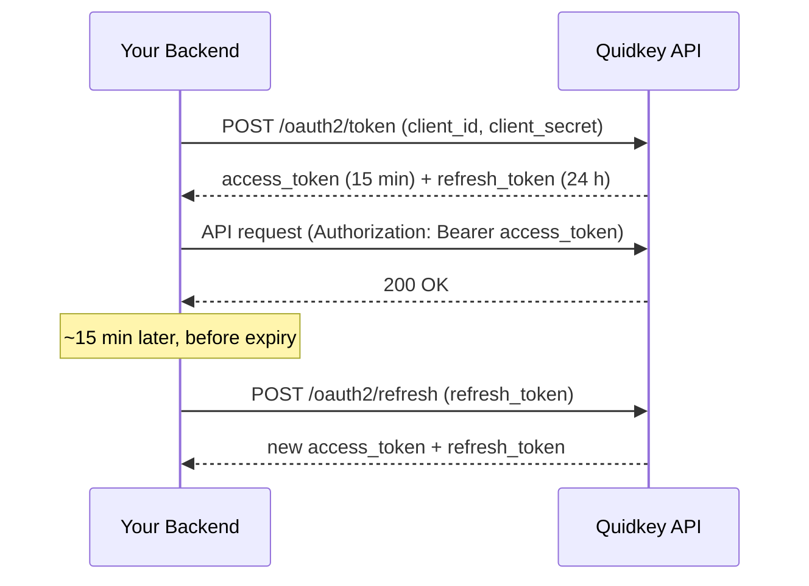

Every Payment API request is authenticated with an **OAuth 2.0 Client Credentials** access token. You exchange your `client_id` and `client_secret` for a short-lived `access_token`, then send that token as a Bearer credential on each request.

<Warning>
Authentication is **server-side only**. Your `client_secret` and the tokens derived from it must never be exposed in a browser, mobile app, or any client your customers control. Treat them like a password.
</Warning>

## Obtain an Access Token

Call `POST /api/v1/oauth2/token` with the `client_credentials` grant. You receive both an `access_token` (for API calls) and a `refresh_token` (to renew it without re-sending your secret).

<CodeGroup>

```bash cURL
curl -X POST 'https://core.quidkey.com/api/v1/oauth2/token' \
  -H 'Content-Type: application/json' \
  -d '{
    "grant_type": "client_credentials",
    "client_id": "YOUR_CLIENT_ID",
    "client_secret": "YOUR_CLIENT_SECRET"
  }'
```

```javascript Node.js
const response = await fetch('https://core.quidkey.com/api/v1/oauth2/token', {
  method: 'POST',
  headers: { 'Content-Type': 'application/json' },
  body: JSON.stringify({
    grant_type: 'client_credentials',
    client_id: process.env.QUIDKEY_CLIENT_ID,
    client_secret: process.env.QUIDKEY_CLIENT_SECRET,
  }),
});

const { data } = await response.json();
const accessToken = data.access_token;
```

```python Python
import os
import requests

response = requests.post(
    'https://core.quidkey.com/api/v1/oauth2/token',
    json={
        'grant_type': 'client_credentials',
        'client_id': os.environ['QUIDKEY_CLIENT_ID'],
        'client_secret': os.environ['QUIDKEY_CLIENT_SECRET'],
    },
)

data = response.json()['data']
access_token = data['access_token']
```

</CodeGroup>

### Response

```json
{
  "success": true,
  "data": {
    "access_token": "eyJhbGciOiJIUzI1NiIsInR5cCI6IkpXVCJ9...",
    "refresh_token": "eyJhbGciOiJIUzI1NiIsInR5cCI6IkpXVCJ9...",
    "token_type": "Bearer",
    "expires_in": 900
  }
}
```

| Field | Description |
|-------|-------------|
| `access_token` | The token you send on every API request. Valid for ~15 minutes. |
| `refresh_token` | Used to obtain a new `access_token` without re-sending your `client_secret`. Valid for 24 hours. |
| `token_type` | Always `Bearer`. |
| `expires_in` | Lifetime of the `access_token` in seconds (`900` = 15 minutes). |

## Authenticate Requests

Send the access token in the `Authorization` header on every Payment API call:

```http
Authorization: Bearer <access_token>
```

```bash
curl 'https://core.quidkey.com/api/v1/redirect-payment-requests' \
  -H 'Authorization: Bearer YOUR_ACCESS_TOKEN' \
  -H 'Content-Type: application/json' \
  -d '{ ... }'
```

A missing, malformed, or expired token returns `401 UNAUTHORIZED`. See [Errors](/guides/payment-api/concepts/errors) for the full error envelope.

## Refresh Before Expiry

Access tokens are intentionally short-lived. Rather than calling `/oauth2/token` for every request, **cache the token and refresh it before it expires** using the `refresh_token`.

<CodeGroup>

```bash cURL
curl -X POST 'https://core.quidkey.com/api/v1/oauth2/refresh' \
  -H 'Content-Type: application/json' \
  -d '{
    "refresh_token": "YOUR_REFRESH_TOKEN"
  }'
```

```javascript Node.js
const response = await fetch('https://core.quidkey.com/api/v1/oauth2/refresh', {
  method: 'POST',
  headers: { 'Content-Type': 'application/json' },
  body: JSON.stringify({ refresh_token: refreshToken }),
});

const { data } = await response.json();
const accessToken = data.access_token;
```

```python Python
response = requests.post(
    'https://core.quidkey.com/api/v1/oauth2/refresh',
    json={'refresh_token': refresh_token},
)

data = response.json()['data']
access_token = data['access_token']
```

</CodeGroup>

The response has the same shape as the token endpoint, including a fresh `access_token` and `expires_in`.

<Tip>
Refresh a little **early** (for example when the token is within ~60 seconds of expiry) so an in-flight request never fails on a token that expires mid-call.
</Tip>

## Token Lifecycle



| Token | Validity | Renewed by |
|-------|----------|-----------|
| `access_token` | ~15 minutes | `POST /api/v1/oauth2/refresh` |
| `refresh_token` | 24 hours | `POST /api/v1/oauth2/token` (with `client_id` + `client_secret`) |

When the `refresh_token` itself expires (after 24 hours), authenticate again from scratch using your `client_id` and `client_secret`.

## Best Practices

<AccordionGroup>

<Accordion title="Keep credentials server-side">
Store `client_id` and `client_secret` in environment variables or a secrets manager (AWS Secrets Manager, HashiCorp Vault, etc.). Never ship them to a browser, mobile binary, or public repository.
</Accordion>

<Accordion title="Cache and reuse the access token">
Hold the `access_token` in memory across requests for its full lifetime instead of minting a new one each time. Track `expires_in` and refresh proactively.
</Accordion>

<Accordion title="Handle 401 gracefully">
If a request returns `401 UNAUTHORIZED`, refresh the token once and retry. If the refresh also fails, fall back to a full `client_credentials` exchange.
</Accordion>

</AccordionGroup>

## Next Steps

<CardGroup cols={2}>
<Card title="Issue a Token" icon="key" href="/api-reference/endpoint/issue-token">
  Try the OAuth flow in the interactive playground
</Card>

<Card title="Idempotency" icon="fingerprint" href="/guides/payment-api/concepts/idempotency">
  Make create calls safe to retry
</Card>

<Card title="Errors" icon="triangle-exclamation" href="/guides/payment-api/concepts/errors">
  Error envelope, status codes, and handling
</Card>

<Card title="API Reference" icon="code" href="/api-reference/introduction">
  Base URLs, response format, and conventions
</Card>
</CardGroup>
