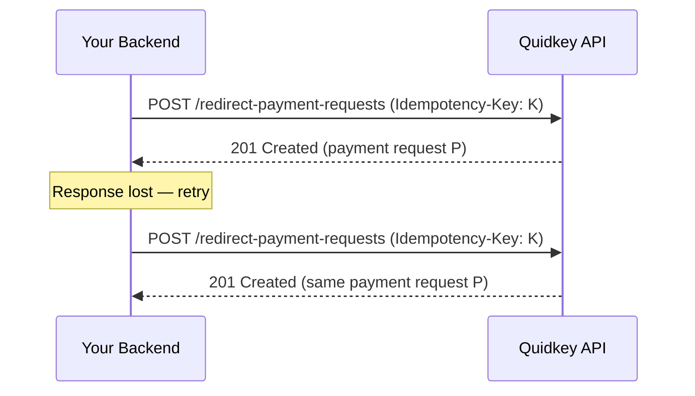

Network failures happen: a request times out, a connection drops, or your service retries before it sees the response. Without protection, a retried "create payment" call could charge a customer twice. **Idempotency keys** let you retry safely — Quidkey recognises the repeat and replays the original result instead of creating a duplicate.

## Send an Idempotency Key

Add an `Idempotency-Key` header to create requests. Use a unique value — a UUID v4 is ideal — for each **logical payment attempt**.

```http
Idempotency-Key: 3f9a2c10-7b6e-4a1c-9d2f-8e5b1c4a6f3d
```

This matters most on create endpoints such as [`POST /api/v1/redirect-payment-requests`](/guides/payment-api/accept-a-payment/redirect), where a duplicate would create a second payment request.

<CodeGroup>

```bash cURL
curl -X POST 'https://core.quidkey.com/api/v1/redirect-payment-requests' \
  -H 'Authorization: Bearer YOUR_ACCESS_TOKEN' \
  -H 'Content-Type: application/json' \
  -H 'Idempotency-Key: 3f9a2c10-7b6e-4a1c-9d2f-8e5b1c4a6f3d' \
  -d '{
    "amount": 1999,
    "currency": "GBP",
    "locale": "en"
  }'
```

```javascript Node.js
import { randomUUID } from 'crypto';

const idempotencyKey = randomUUID();

const response = await fetch(
  'https://core.quidkey.com/api/v1/redirect-payment-requests',
  {
    method: 'POST',
    headers: {
      'Authorization': `Bearer ${accessToken}`,
      'Content-Type': 'application/json',
      'Idempotency-Key': idempotencyKey,
    },
    body: JSON.stringify({ amount: 1999, currency: 'GBP', locale: 'en' }),
  },
);
```

```python Python
import uuid

idempotency_key = str(uuid.uuid4())

response = requests.post(
    'https://core.quidkey.com/api/v1/redirect-payment-requests',
    headers={
        'Authorization': f'Bearer {access_token}',
        'Content-Type': 'application/json',
        'Idempotency-Key': idempotency_key,
    },
    json={'amount': 1999, 'currency': 'GBP', 'locale': 'en'},
)
```

</CodeGroup>

## How Replay Works

Quidkey scopes idempotency keys per merchant. When it sees a key it has handled before, it returns the original response rather than performing the action again.



| Scenario | Result |
|----------|--------|
| Same key **+** same merchant, request already completed | Replays the **original** response. No duplicate is created. |
| Same key, request still in flight (concurrent) | `409 IDEMPOTENT_REQUEST_IN_PROGRESS` |
| Idempotency store unavailable | `503 IDEMPOTENCY_STORE_UNAVAILABLE` (retryable) |

<Note>
Idempotency keys are scoped to **your merchant**. The same key value used by a different merchant is treated as an independent request.
</Note>

## Concurrent Requests

If two requests carrying the **same** key arrive before the first finishes, the second returns `409 IDEMPOTENT_REQUEST_IN_PROGRESS`. The first request is still being processed — wait briefly and retry with the **same key** to pick up the replayed result.

```json
{
  "success": false,
  "error": {
    "code": "IDEMPOTENT_REQUEST_IN_PROGRESS",
    "message": "A request with this idempotency key is already being processed."
  }
}
```

## When the Store Is Unavailable

If Quidkey cannot reach the idempotency store, it **fails closed** rather than risk a duplicate, returning `503 IDEMPOTENCY_STORE_UNAVAILABLE`.

```json
{
  "success": false,
  "error": {
    "code": "IDEMPOTENCY_STORE_UNAVAILABLE",
    "message": "The idempotency store is temporarily unavailable. Please retry."
  }
}
```

<Warning>
A `503 IDEMPOTENCY_STORE_UNAVAILABLE` means the request was **not** processed. It is safe — and expected — to retry with the **same** idempotency key, ideally with exponential backoff.
</Warning>

## Best Practices

<AccordionGroup>

<Accordion title="One key per logical attempt">
Generate a fresh key when you start a **new** payment attempt. Persist it alongside your order so retries of that same attempt reuse it.
</Accordion>

<Accordion title="Reuse the key when retrying">
On a timeout or transient error, retry with the **same** key. A new key on retry defeats the protection and can create a duplicate.
</Accordion>

<Accordion title="Use a fresh key for a genuinely new attempt">
If the customer deliberately starts over (e.g. a new checkout for a new basket), mint a new key — it is a different logical attempt.
</Accordion>

</AccordionGroup>

## Next Steps

<CardGroup cols={2}>
<Card title="Errors" icon="triangle-exclamation" href="/guides/payment-api/concepts/errors">
  Status codes including 409 and 503
</Card>

<Card title="Accept a Payment (Redirect)" icon="arrow-right-arrow-left" href="/guides/payment-api/accept-a-payment/redirect">
  Create a redirect payment request
</Card>

<Card title="Authentication" icon="key" href="/guides/payment-api/concepts/authentication">
  Obtain and refresh access tokens
</Card>

<Card title="Webhooks" icon="webhook" href="/guides/payment-api/concepts/webhooks">
  Receive payment results reliably
</Card>
</CardGroup>
