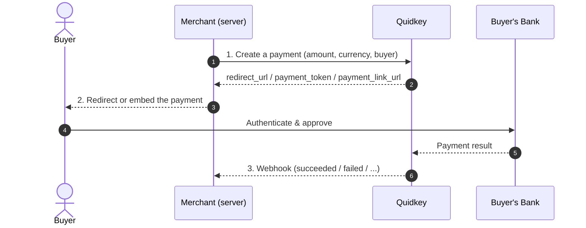

Accept bank-to-bank payments with Quidkey: create a payment from your backend, send your buyer to a bank to approve it, and receive a webhook when it settles. Every integration path uses the same credentials, authentication, and webhooks.

You choose how the payment is presented to the buyer. Want zero frontend work? Use a **Redirect** and send the buyer to a Quidkey-hosted bank page. Already running a Stripe checkout? Drop Quidkey in alongside it with the **Embedded** flow. Sending an invoice? Generate a **Hosted Checkout** link and share the URL.

<Note>
**Amounts are always integer minor units** across every endpoint in the Payment API: `1000` = £10.00, `2550` = €25.50. See [Amounts & Currencies](/guides/payment-api/concepts/amounts-and-currencies).
</Note>

<Info>
**Before you start:** sign up and grab your `client_id` and `client_secret` from the [Quidkey Console](https://console.quidkey.com). You'll exchange them for an access token on your first call.
</Info>

## Base URL

All Payment API requests go to `https://core.quidkey.com`. There's no separate sandbox host: set `test_transaction: true` to route a request to the sandbox (see [Testing](/guides/payment-api/concepts/testing)).

<Warning>
Always set `test_transaction: true` while developing so you never move real money. Test payments flow through the same endpoints and fire the same webhooks as live payments.
</Warning>

## Three Ways to Accept a Payment

Every path uses the same OAuth credentials, integer minor-unit amounts, and webhooks. They differ only in where the buyer completes the payment and how much frontend code you write.

| | **Redirect (Pay by Bank)** | **Embedded (with Stripe)** | **Hosted Checkout** |
|---|---|---|---|
| **Best for** | Fast launch, full control of your own UI | E-commerce checkouts already using Stripe | Invoicing, ad-hoc and no-code payments |
| **Frontend effort** | Redirect the buyer to a URL | Embed an iframe + Stripe mutual exclusion | None: share a link |
| **Buyer details** | Collected by you, sent at create time | Collected by you, sent at create time | Collected on the Quidkey checkout page |
| **Buyer completes on** | Quidkey-hosted bank page | Inline on your site, then their bank | Quidkey-hosted checkout page |
| **Amount format** | Integer minor units | Integer minor units | Integer minor units |

<Tip>
**Need more than one?** They all share the same backend API and webhook infrastructure, so you can mix them freely: Embedded on your checkout page, Hosted Checkout for invoice emails, and Redirect for a lightweight standalone flow.
</Tip>

## The Create → Redirect/Embed → Webhook Model

Every Payment API integration follows the same three-beat rhythm, no matter which path you pick:

<Steps>
<Step title="Create">
  Call the create endpoint for your chosen path with an authenticated request. You get back a `redirect_url`, a `payment_token`, or a `payment_link_url`.
</Step>

<Step title="Redirect or embed">
  Send the buyer to the bank page (Redirect / Hosted Checkout) or render the inline iframe (Embedded). The buyer approves the payment in their own bank.
</Step>

<Step title="Webhook">
  Quidkey sends a [webhook](/guides/payment-api/concepts/webhooks) to your backend with the final result. **The webhook is the source of truth**, not the browser redirect. Fulfil orders only when you receive `quidkey.payment_request.succeeded`. Webhook delivery is a [single attempt with no automatic retry](/guides/payment-api/concepts/webhooks), so the merchant status endpoint is your reconcile backstop for any event you never received.
</Step>
</Steps>

## Start Here

<CardGroup cols={2}>
<Card title="Quickstart" icon="rocket" href="/guides/payment-api/quickstart">
  Your first payment in about 10 minutes, end to end
</Card>

<Card title="Authentication" icon="key" href="/guides/payment-api/concepts/authentication">
  Exchange your client credentials for an access token
</Card>
</CardGroup>

### Accept a Payment

<CardGroup cols={3}>
<Card title="Redirect (Pay by Bank)" icon="arrow-up-right-from-square" href="/guides/payment-api/accept-a-payment/redirect">
  Create a payment and redirect the buyer to a Quidkey-hosted bank page
</Card>

<Card title="Embedded (with Stripe)" icon="credit-card" href="/guides/payment-api/accept-a-payment/embedded">
  Add Quidkey alongside your existing Stripe Payment Element
</Card>

<Card title="Hosted Checkout" icon="link" href="/guides/payment-api/accept-a-payment/hosted-checkout">
  Generate a shareable checkout URL in one API call
</Card>
</CardGroup>

### Core Concepts

<CardGroup cols={2}>
<Card title="Authentication" icon="key" href="/guides/payment-api/concepts/authentication">
  Obtain, use, and refresh OAuth 2.0 access tokens
</Card>

<Card title="Idempotency" icon="fingerprint" href="/guides/payment-api/concepts/idempotency">
  Send an `Idempotency-Key` so retries never create duplicate payments
</Card>

<Card title="Webhooks" icon="webhook" href="/guides/payment-api/concepts/webhooks">
  Receive payment status updates and verify signatures
</Card>

<Card title="Errors" icon="triangle-exclamation" href="/guides/payment-api/concepts/errors">
  The error envelope, status codes, and how to handle failures
</Card>

<Card title="Amounts & Currencies" icon="coins" href="/guides/payment-api/concepts/amounts-and-currencies">
  Integer minor units and ISO 4217 currencies, everywhere
</Card>

<Card title="API Reference" icon="terminal" href="/api-reference/introduction">
  Explore every endpoint with an interactive playground
</Card>
</CardGroup>
