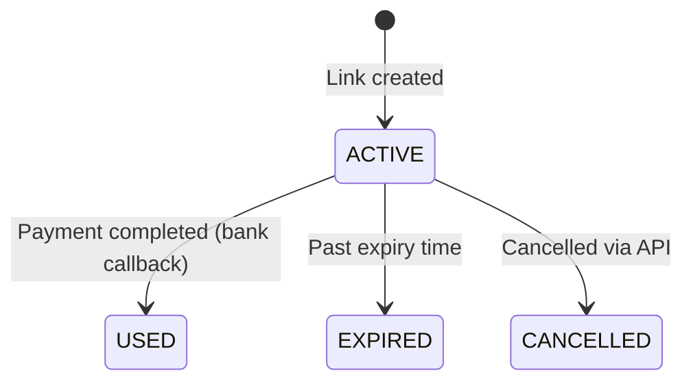

Once you've created and shared a payment link, you can track its status, receive webhook notifications when a payment completes, and manage your links through the API.

## Check Link Status

Retrieve a payment link by its ID to check the current status.

<CodeGroup>

```bash cURL
curl 'https://core.quidkey.com/api/v1/payment-links/LINK_ID' \
  -H 'Authorization: Bearer YOUR_ACCESS_TOKEN'
```

```javascript Node.js
const response = await fetch(
  `https://core.quidkey.com/api/v1/payment-links/${linkId}`,
  {
    headers: { 'Authorization': `Bearer ${accessToken}` }
  }
);

const { data } = await response.json();
console.log('Status:', data.status);
console.log('Views:', data.views_count);
console.log('Transaction:', data.transaction_id);
```

```python Python
response = requests.get(
    f'https://core.quidkey.com/api/v1/payment-links/{link_id}',
    headers={'Authorization': f'Bearer {access_token}'}
)

data = response.json()['data']
print(f"Status: {data['status']}")
print(f"Views: {data['views_count']}")
print(f"Transaction: {data['transaction_id']}")
```

</CodeGroup>

### Response

```json
{
  "success": true,
  "data": {
    "id": "a1b2c3d4-e5f6-7890-abcd-ef1234567890",
    "merchant": {
      "id": "m1234567-abcd-ef01-2345-678901234567",
      "brand_name": "Acme Corp"
    },
    "amount": "50.00",
    "currency": "EUR",
    "payment_reference": "INV-2024-001",
    "order_id": null,
    "status": "used",
    "link_type": "single_use",
    "views_count": 3,
    "first_viewed_at": "2024-04-01T14:30:00.000Z",
    "expires_at": "2024-04-07T12:00:00.000Z",
    "created_at": "2024-03-31T12:00:00.000Z",
    "transaction_id": "t9876543-dcba-fe01-2345-678901234567",
    "locale": "en",
    "metadata": null,
    "payment_link_url": "https://core.quidkey.com/payment-link/a1b2c3d4e5f6...",
    "redirect_urls": null
  }
}
```

### Response Fields

| Field | Description |
|-------|-------------|
| `status` | Current link status: `active`, `used`, `expired`, or `cancelled` |
| `views_count` | Number of times the checkout page has been opened |
| `first_viewed_at` | When the link was first opened (null if never viewed) |
| `transaction_id` | The resulting transaction ID when payment is complete (null otherwise) |
| `payment_link_url` | The shareable URL (recovered from encrypted storage) |

<Tip>
**Link-to-transaction navigation:** When `transaction_id` is present, you can use it to look up the full transaction details in the Quidkey Console or via the API.
</Tip>

## Status Transitions

Payment link status changes are driven by customer actions and system events:



| Transition | Trigger |
|------------|---------|
| ACTIVE → USED | The customer's bank confirms the payment (callback). Single-use links only. |
| ACTIVE → EXPIRED | The link passes its `expires_at` time. Checked on demand when the link is accessed. |
| ACTIVE → CANCELLED | You cancel the link via the API. |

<Note>
**Expiry is checked on demand.** Quidkey marks a link as expired when it is next accessed (via the public checkout page or the API), not via a background job. This means a link's status in the database may show `active` until someone accesses it after the expiry time.
</Note>

## Redirect URLs

If you provided `redirect_urls` when creating the payment link, the customer is redirected to your URLs instead of Quidkey's default pages. Quidkey appends query parameters to help you correlate the redirect:

| Parameter | Description |
|-----------|-------------|
| `status` | `success` or `failed` |
| `payment_reference` | The payment reference from the link |
| `order_id` | Your order ID (if provided at creation) |

Example redirect after successful payment:
```
https://yoursite.com/payment/success?status=success&payment_reference=INV-2024-001&order_id=ORD-123
```

<Note>
Custom redirects are informational only. Do not use them to confirm payment status. Always use webhooks or the API to verify that payment was actually completed. A customer could manually navigate to your success URL without paying.
</Note>

## Webhook Notifications

When a payment is completed through a payment link, you receive the same webhook notification as payments made through the Embedded Flow. The webhook payload includes the transaction details.

To set up webhooks, see the [Webhook documentation](/api-reference/webhook/register-or-update-a-merchant-webhook-url).

## List Payment Links

Retrieve all payment links with optional filtering and pagination.

<CodeGroup>

```bash cURL
# List all active links
curl 'https://core.quidkey.com/api/v1/payment-links?status=active&limit=20' \
  -H 'Authorization: Bearer YOUR_ACCESS_TOKEN'

# Search by payment reference
curl 'https://core.quidkey.com/api/v1/payment-links?search=INV-2024' \
  -H 'Authorization: Bearer YOUR_ACCESS_TOKEN'
```

```javascript Node.js
// List all active links
const response = await fetch(
  'https://core.quidkey.com/api/v1/payment-links?status=active&limit=20',
  {
    headers: { 'Authorization': `Bearer ${accessToken}` }
  }
);

const { data, pagination } = await response.json();
console.log(`Found ${pagination.total} links (page ${pagination.page})`);
```

```python Python
# List all active links
response = requests.get(
    'https://core.quidkey.com/api/v1/payment-links',
    headers={'Authorization': f'Bearer {access_token}'},
    params={'status': 'active', 'limit': 20}
)

result = response.json()
print(f"Found {result['pagination']['total']} links")
```

</CodeGroup>

### Query Parameters

| Parameter | Type | Default | Description |
|-----------|------|---------|-------------|
| `status` | string | _none_ | Filter by status: `active`, `used`, `expired`, `cancelled` |
| `search` | string | _none_ | Search by payment reference or order ID |
| `merchant_id` | string | _none_ | Filter by merchant ID (partner authentication only) |
| `page` | integer | `1` | Page number (1-based) |
| `limit` | integer | `20` | Items per page (max 100) |

### Paginated Response

```json
{
  "success": true,
  "data": [
    {
      "id": "a1b2c3d4-...",
      "merchant": { "id": "m1234...", "brand_name": "Acme Corp" },
      "amount": "50.00",
      "currency": "EUR",
      "payment_reference": "INV-2024-001",
      "order_id": null,
      "status": "active",
      "link_type": "single_use",
      "views_count": 0,
      "first_viewed_at": null,
      "expires_at": "2024-04-07T12:00:00.000Z",
      "created_at": "2024-03-31T12:00:00.000Z",
      "transaction_id": null
    }
  ],
  "pagination": {
    "page": 1,
    "limit": 20,
    "total": 1,
    "totalPages": 1
  }
}
```

## Error Handling

Payment link endpoints return consistent error responses:

| Status | Error Code | Meaning |
|--------|-----------|---------|
| `404` | `PAYMENT_LINK_NOT_FOUND` | Token or ID does not match any link |
| `410` | `PAYMENT_LINK_NOT_ACTIVE` | Link is used, expired, or cancelled |
| `400` | `INVALID_INPUT` | Request validation failed |
| `401` | `UNAUTHORIZED` | Missing or invalid authentication |

<Note>
**Expired links return details, not errors.** The public `GET /payment-links/:token/details` endpoint returns the link with `status: "expired"` rather than throwing an error. This allows the checkout page to show an appropriate message to the customer.
</Note>

## Next Steps

<CardGroup cols={2}>
<Card title="Overview" icon="link" href="/guides/payment-links/overview">
  Hosted Checkout overview and lifecycle
</Card>

<Card title="Create a Checkout Link" icon="plus" href="/guides/payment-links/create">
  Generate and share your first checkout link
</Card>

<Card title="Webhook Setup" icon="webhook" href="/api-reference/webhook/register-or-update-a-merchant-webhook-url">
  Configure webhooks to receive payment notifications
</Card>

<Card title="API Reference" icon="code" href="/api-reference/payment-links/create-a-payment-link">
  Full endpoint documentation with interactive playground
</Card>
</CardGroup>
