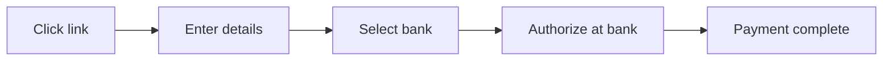

When a customer clicks a payment link, they're taken to a Quidkey-hosted checkout page. This page collects their details, lets them select their bank, and redirects them to complete the payment — all without any frontend code on your side.

## Customer Journey

<Steps>
<Step title="Customer opens the link">
  The customer clicks the payment link URL you shared. Quidkey loads the hosted checkout page showing the merchant name, payment amount, and reference.
</Step>

<Step title="Customer fills in their details">
  The checkout page presents a form where the customer enters:
  - **Full name**
  - **Email address**
  - **Phone number** (E.164 format)
  - **Country**

  These details are used to create the payment request and help Quidkey predict the customer's bank.
</Step>

<Step title="Customer selects their bank">
  After submitting the form, Quidkey's bank selection iframe appears. Quidkey automatically predicts and pre-selects the customer's bank based on their country and information. The customer can change the selection if needed.
</Step>

<Step title="Customer authorizes at their bank">
  The customer is redirected to their bank's authentication page (or mobile app) to approve the payment. This is the standard Open Banking authorization flow — the bank verifies the customer's identity.
</Step>

<Step title="Payment complete">
  After authorization, the customer is redirected to a success or failure page. You receive a webhook notification with the payment result.
</Step>
</Steps>

## Checkout Page Layout

The checkout page uses a responsive two-column layout:

| Section | Content |
|---------|---------|
| **Left column** | Checkout header, merchant name, customer form, bank selection (mobile), trust badges |
| **Right column** | Order summary card: merchant avatar, payment reference, total amount, bank selection (desktop) |

On mobile devices, the layout collapses to a single column with the order summary above the form.

## Re-confirmation Support

If a customer has already submitted the form but hasn't completed the payment (e.g., they closed the bank app), they can return to the same link and update their details. The checkout page allows re-confirmation — submitting the form again creates a new payment request with the updated customer information.

<Tip>
**Single-use links** remain active until the payment is actually completed (confirmed by the bank callback). This means a customer can retry or update their details as many times as needed before paying.
</Tip>

## Status-Based Display

The checkout page adapts based on the payment link's current status:

| Status | What the customer sees |
|--------|----------------------|
| **ACTIVE** | Full checkout form with payment flow |
| **USED** | Message indicating the payment has already been completed |
| **EXPIRED** | Message indicating the link has expired |
| **CANCELLED** | Message indicating the link is no longer available |

Only `ACTIVE` links show the payment form. All other statuses display an informational message.

## Security

The hosted checkout page is designed with security in mind:

- **Token-based access** — Links use 256-bit cryptographic tokens. The token is hashed (SHA-256) before database lookup, so raw tokens are never stored.
- **No sensitive data exposure** — The public checkout endpoint only returns the merchant name, amount, currency, and reference. Internal IDs, merchant IDs, and tracking data are never exposed.
- **Bank-grade authentication** — Customers authorize payments directly in their bank app. Quidkey never sees banking credentials.

## Next Steps

<CardGroup cols={2}>
<Card title="After Payment" icon="chart-line" href="/guides/payment-links/after-payment">
  Track payment status and manage your links
</Card>

<Card title="Create a Payment Link" icon="plus" href="/guides/payment-links/create">
  Generate and share your first payment link
</Card>
</CardGroup>
