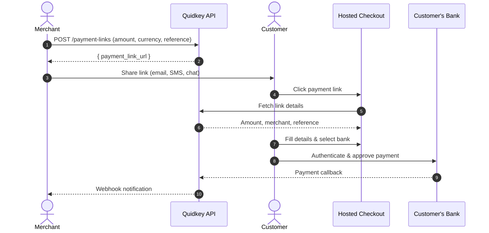

Payment Links are shareable URLs that direct customers to a Quidkey-hosted checkout page for bank-to-bank payments. Create a link, send it to your customer via email, SMS, or any messaging channel, and get paid — no frontend integration needed.

<CardGroup cols={2}>
<Card title="Create a Payment Link" icon="plus" href="/guides/payment-links/create">
  Create and share your first payment link via the API
</Card>

<Card title="Checkout Experience" icon="browser" href="/guides/payment-links/checkout-experience">
  What your customers see when they open a payment link
</Card>

<Card title="After Payment" icon="chart-line" href="/guides/payment-links/after-payment">
  Track status, handle webhooks, and manage links
</Card>

<Card title="API Reference" icon="code" href="/api-reference/payment-links/create-a-payment-link">
  Full endpoint documentation with interactive playground
</Card>
</CardGroup>

## When to Use Payment Links

Payment Links and the Embedded Flow serve different integration needs:

| | **Payment Links** | **Embedded Flow** |
|---|---|---|
| **Best for** | Invoicing, ad-hoc payments, no-code scenarios | E-commerce checkouts, in-app payments |
| **Integration effort** | API call to create link, then share the URL | Embed iframe, handle postMessage events |
| **Customer experience** | Quidkey-hosted checkout page | Inline checkout on your site |
| **Frontend code** | None | HTML/JavaScript for iframe |
| **Use case** | B2B invoices, service payments, cross-border pay-ins | Online stores, subscription platforms |

<Tip>
**Already using the Embedded Flow?** You can use both. Payment Links are ideal for scenarios where you need to collect a payment outside your checkout page — like sending an invoice link via email.
</Tip>

## How It Works

## Link Lifecycle

Every payment link has a status that tracks its progress:

| Status | Meaning |
|--------|---------|
| **ACTIVE** | Ready for use. Customers can open the link and complete payment. |
| **USED** | Payment completed (single-use links only). The link can no longer accept payments. |
| **EXPIRED** | Past its expiry time. Default expiry is 7 days, configurable at creation. |
| **CANCELLED** | Manually cancelled via API. |

<Note>
**Single-use vs Reusable:** By default, links are single-use — they transition to USED when a customer completes payment. Set `link_type: "reusable"` to create links that stay ACTIVE for repeated payments (useful for donation pages or recurring invoices).
</Note>

## Key Features

- **Shareable URLs** — Send via any channel: email, SMS, WhatsApp, messaging apps
- **Hosted checkout** — Quidkey-branded checkout page, no frontend code needed
- **Configurable expiry** — Default 7 days, or set a custom duration
- **Single-use and reusable** — One-time payment links or persistent links for repeated use
- **View tracking** — See how many times a link has been opened
- **Recoverable URLs** — Copy the link URL at any time from the Console or API (encrypted token storage)
- **Link-to-transaction** — When a link is used, navigate directly to the resulting transaction

## Next Steps

<Steps>
<Step title="Create your first payment link">
  Follow the [Create a Payment Link](/guides/payment-links/create) guide to generate and share your first link.
</Step>

<Step title="Understand the checkout experience">
  See [what your customers see](/guides/payment-links/checkout-experience) when they open a payment link.
</Step>

<Step title="Track and manage links">
  Learn how to [monitor payment status](/guides/payment-links/after-payment), handle webhooks, and list your links.
</Step>
</Steps>
