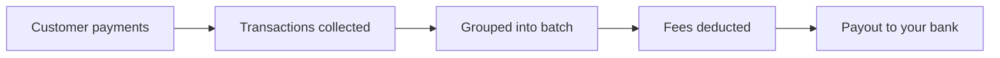

Payout reconciliation lets you see exactly which transactions and fees make up each payout to your bank account. Every payout batch groups the transactions that were settled together, with a full breakdown of amounts, fees, and retention.

<CardGroup cols={2}>
<Card title="Export Transactions" icon="file-arrow-down" href="/guides/payouts/export">
  Download all transactions in a payout batch as CSV or Excel
</Card>

<Card title="Merchant Console" icon="browser" href="https://merchants.quidkey.com">
  View and manage payouts in your dashboard
</Card>
</CardGroup>

## How payouts work

When your customers complete payments through Quidkey, those transactions are collected and grouped into **payout batches**. Each batch represents a single transfer to your bank account.

Every batch includes:

- **Total amount**: the gross sum of all transactions in the batch
- **Fees**: processing fees deducted from the total
- **Retained amount**: any amount held back based on your retention rate
- **Payout amount**: the net amount transferred to your bank account

## Viewing payout batches

Navigate to **Payouts** in the merchant console to see all your payout batches. You can filter by status:

| Status | Meaning |
|--------|---------|
| **Pending** | Batch created, awaiting execution |
| **Processing** | Payout transfer in progress |
| **Completed** | Funds transferred to your bank account |
| **Failed** | Transfer failed. Contact support if this persists |

Click any batch to see the full detail page with the amount breakdown.

## Payout detail

The detail page for each batch shows:

- **Payment reference**: the unique reference for this payout, visible on your bank statement
- **Amount breakdown**: total, payout, retained, and retention rate at a glance
- **Transaction count**: how many transactions are included
- **Timestamps**: when the batch was created and executed

From the detail page you can export all transactions as CSV or Excel for reconciliation with your accounting system.

## Reconciliation workflow

A typical reconciliation flow looks like this:

<Steps>
<Step title="Match the payout to your bank statement">
  Find the payout in your bank statement using the **payment reference**. This reference appears both in the merchant console and on your bank transaction.
</Step>

<Step title="Open the payout detail">
  Click the matching batch in the merchant console to see the amount breakdown and verify the payout amount matches your bank statement.
</Step>

<Step title="Export the transactions">
  Download the batch as CSV or Excel to get a line-by-line breakdown of every transaction, including fees, exchange rates, and customer details. See [Export transactions](/guides/payouts/export) for the full field reference.
</Step>

<Step title="Import into your accounting system">
  Match individual transactions against your invoices or orders using the **Order ID** and **Transaction Number** fields.
</Step>
</Steps>

<Tip>
The **Order ID** field in the exported file corresponds to the `order_id` you provided when creating the payment. Use this to link payout transactions back to your internal records.
</Tip>

## Next steps

<CardGroup cols={2}>
<Card title="Export transactions" icon="file-arrow-down" href="/guides/payouts/export">
  Download and understand the transaction export
</Card>

<Card title="API Reference" icon="code" href="/api-reference/introduction">
  Full endpoint documentation
</Card>
</CardGroup>
