# Quidkey Open Banking Integration Guide

## Integration Flow

```mermaid
sequenceDiagram
    autonumber
    actor Customer
    participant Merchant as Tryp (frontend)
    participant Backend as Tryp (server)
    participant Quidkey
    Customer->>Merchant: Browse & fill checkout (Steps 1-3)
    Merchant->>Backend: Finalise price (Step 4)
    Backend->>Quidkey: POST /embedded/payment-requests
    Quidkey-->>Backend: { payment_token }
    Backend-->>Merchant: Render checkout + inject <iframe src="…?payment_token=…">
    Merchant->>Quidkey: GET /embedded (iframe bootstrap)
    Quidkey-->>Merchant: Bank picker HTML
    opt Dynamic Updates (shipping, discounts, etc.)
        Customer->>Merchant: Change shipping/apply code
        Merchant->>Backend: Calculate new total
        Backend->>Quidkey: PATCH /embedded/payment-requests
        Quidkey-->>Backend: { updated amount/rewards }
        Backend-->>Merchant: Update confirmed
        Merchant->>Merchant: Refresh iframe & UI
    end
    Customer->>Merchant: Click preferred bank
    Merchant->>Merchant: postMessage { type: 'quidkey-state-update', bankId, paymentScheme }
    Merchant->>Backend: POST /embedded/payment-initiation (bankId, payment_token, paymentScheme)
    Backend->>Quidkey: POST /payment-initiations
    Quidkey-->>Backend: { payment_link }
    Backend-->>Merchant: { payment_link }
    Merchant-->>Customer: Redirect to bank (SCA)
    Customer->>Quidkey: Authenticate & approve payment
    alt Success
        Quidkey-->>Customer: Redirect to success_url
    else Failure / cancel
        Quidkey-->>Customer: Redirect to failure_url
    end
    Quidkey-->>Backend: Webhook → update payment status + fees (if successful)
```



This guide explains how Tryp can add the Quidkey open-banking option next to the existing Stripe Payment Element. The customer sees a single payment section where exactly one method (Stripe **or** Quidkey) can be selected at a time.

**💡 Fee Processing**: For successful transactions, QuidKey calculates fees automatically and includes detailed fee information in webhook payloads for merchant accounting, billing reconciliation, and cost tracking. Fees are processed in merchant backend systems only and are not displayed to customers.

**🔄 Dynamic Updates**: Payment amounts and rewards can be updated after creation but before the customer initiates payment with their bank. This enables real-time adjustments for shipping costs, discounts, and promotional offers without requiring a new payment token.

## 1. Backend Changes

### 1.1 Authenticate Once Per Session

Before you can create the payment request you must exchange the client_id / client_secret you received from Quidkey for an access_token. The token is valid for ~15 minutes and must be sent in the Authorization: Bearer … header of every server-to-server call to Quidkey (create-payment-request, refunds, etc.).

```http
POST https://core.quidkey.com/oauth2/token
Content-Type: application/json
{
  "client_id"    : "<your-client-id>",
  "client_secret": "<your-client-secret>"
}
```

Successful response (trimmed):

```json
{
  "access_token" : "eyJhbGci…",
  "refresh_token": "eyJhbGci…",
  "expires_in"   : 900,
  "token_type"   : "Bearer"
}
```

- `access_token` – include as `Authorization: Bearer <token>` in subsequent calls
- `refresh_token` – call `/oauth2/refresh` to obtain a new access_token without re-posting credentials
- Full details in the Auth API

### 1.2 Create a Payment Request (Server → Quidkey)

Use the bearer token to request a payment_token. This call should be made once the customer has locked in the final price at the end of Step 4 (after they choose Flexible vs None).

```http
POST https://core.quidkey.com/embedded/payment-requests
Authorization: Bearer <access_token>
Content-Type: application/json
{
  "customer": {
    "name"   : "Jack Haversham",
    "email"  : "jack@example.com",
    "phone"  : "+351960306459",
    "country": "PT"
  },
  "order": {
    "order_id"           : "ORD-123456",
    "amount"             : 2550, // 2550 = 25.50 | 100 = 1.00
    "currency"           : "EUR",
    "payment_reference"  : "Barcelona Tryp", // 18 chars max. Customer sees this on bank statement
    "locale"             : "en-GB",
    "test_transaction"   : true, // boolean
    "rewards": {         // optional - merchant reward information
      "extra_rewards"    : 150, // reward points for this transaction
      "total_rewards"    : 300, // optional total points (base + extra)
      "description"      : "Loyalty bonus + base rewards" // optional description
    }
  },
  "redirect_urls": {
    "success_url": "https://tryp.com/checkout/success",
    "failure_url": "https://tryp.com/checkout/error"
  }
}
```

**💡 Amount Explanation:**
- `"amount": 2550` represents €25.50 (2550 cents)
- This matches Stripe's format exactly: `stripe.paymentIntents.create({ amount: 2550, currency: 'eur' })`
- Always use integers - never decimals like `25.50`

**💡 Rewards Explanation:**
- `"rewards"` object is optional - include only if you want to offer customer rewards
- `"extra_rewards"`: Reward points for this transaction (required if rewards included)
- `"total_rewards"`: Total points customer will receive (optional - use when you want to show both transaction-specific and total rewards)
- `"description"`: Optional text describing the reward offer (max 255 characters)
- **Flexible Usage**: You can send just `extra_rewards`, just `total_rewards`, or both depending on your needs
- Rewards are distributed to customers only on successful payment completion via webhook
- All reward values must be non-negative numbers
- If both values provided: `total_rewards` must be ≥ `extra_rewards`

**💡 Rewards Usage Examples:**

```json
// Example 1: Transaction-specific rewards only
"rewards": {
  "extra_rewards": 150,
  "description": "Bonus for weekend purchase"
}

// Example 2: Total rewards only (simpler for merchants)
"rewards": {
  "total_rewards": 300,
  "description": "Your loyalty rewards"
}

// Example 3: Both values (full transparency)
"rewards": {
  "extra_rewards": 150,    // bonus for this transaction
  "total_rewards": 300,    // 150 base + 150 bonus
  "description": "Weekend bonus + base rewards"
}
```

Response:

```json
{
  "success": true,
  "data": {
    "payment_token": "ptok_efghijklm…",
    "expires_in": 900
  }
}
```

#### Guidelines

- **When to call** – right after the customer confirms price & options (Step 4)
- **TTL 15 min** – create a fresh token if the shopper restarts checkout
- Re-use the same token on page reloads within TTL
- **Amount format** – Always use minor units (cents/pence) as integers

### 1.3 Update a Payment Request (Server → Quidkey) [NEW]

After creating a payment request, you can update the amount and/or rewards **before** the customer initiates payment with their bank. This is useful for:

- **Dynamic shipping costs**: Calculate exact shipping after address confirmation
- **Real-time promotions**: Apply time-sensitive discounts or bonuses
- **Cart modifications**: Handle last-minute quantity changes
- **Tax adjustments**: Update based on final delivery location

```http
PATCH https://core.quidkey.com/embedded/payment-requests
Authorization: Bearer <access_token>
Content-Type: application/json
{
  "payment_token": "ptok_efghijklm…",
  "amount": 2750,              // optional - new amount (27.50 EUR)
  "rewards": {                 // optional - updated rewards
    "extra_rewards": 200,      // updated bonus points
    "total_rewards": 400,      // updated total points
    "description": "Flash sale bonus!"
  }
}
```

**🔐 Security:**
- Only the merchant who created the payment request can update it
- The same Bearer token authentication is required
- Updates are atomic - all changes happen together or not at all

**⏱️ Update Window:**
- Updates allowed only while payment status is `pending`
- Once customer clicks a bank and starts payment (`payment_initiated_at` is set), only rewards can be updated
- Amount updates are blocked after payment initiation to prevent customer confusion

**Response:**

```json
{
  "success": true,
  "data": {
    "payment_token": "ptok_efghijklm…",  // same token (unchanged)
    "amount": 2750,                      // updated amount
    "rewards": {                         // updated rewards (if provided)
      "extra_rewards": 200,
      "total_rewards": 400,
      "description": "Flash sale bonus!"
    },
    "expires_in": 720                    // remaining TTL in seconds
  }
}
```

**📝 Important Notes:**
- The `payment_token` remains the same - no need to update your frontend
- The Quidkey iframe automatically reflects the updated amount when refreshed
- At least one of `amount` or `rewards` must be provided
- All previous values are replaced with the new ones (no partial updates)

**Error Responses:**

| Status | Error Code | Description |
|--------|------------|-------------|
| 400 | `INVALID_AMOUNT` | Amount validation failed (e.g., negative, zero) |
| 400 | `INVALID_REWARDS` | Rewards validation failed |
| 400 | `INVALID_UPDATE_REQUEST` | Neither amount nor rewards provided |
| 409 | `PAYMENT_ALREADY_INITIATED` | Cannot update amount after payment started |
| 410 | `EXPIRED_OR_INVALID_PAYMENT_TOKEN` | Token expired or not found |

**Integration Example:**

```javascript
// Backend: Update payment after shipping calculation
async function updatePaymentWithShipping(paymentToken, shippingCost) {
  const originalAmount = 2550;  // €25.50
  const newAmount = originalAmount + shippingCost;

  const response = await fetch('https://core.quidkey.com/embedded/payment-requests', {
    method: 'PATCH',
    headers: {
      'Authorization': `Bearer ${accessToken}`,
      'Content-Type': 'application/json'
    },
    body: JSON.stringify({
      payment_token: paymentToken,
      amount: newAmount
    })
  });

  if (!response.ok) {
    const error = await response.json();

    // Handle specific errors
    if (error.error_code === 'PAYMENT_ALREADY_INITIATED') {
      // Customer already started payment - too late to update
      return { success: false, reason: 'Payment in progress' };
    }

    throw new Error(error.message);
  }

  return await response.json();
}

// Frontend: Refresh iframe after update
async function applyShippingAndRefreshPayment(shippingCost) {
  // 1. Call your backend to update the payment
  const result = await fetch('/api/update-payment-shipping', {
    method: 'POST',
    body: JSON.stringify({ paymentToken, shippingCost })
  });

  if (result.ok) {
    // 2. Refresh the Quidkey iframe to show new amount
    const iframe = document.getElementById('quidkey-iframe');
    iframe.src = iframe.src; // Force reload

    // 3. Update your UI to show new total
    updateOrderTotal(result.data.amount);
  }
}
```

**Best Practices:**
- **Timing**: Update as soon as the final amount is known
- **User Experience**: Show loading state during updates
- **Error Handling**: Gracefully handle update failures (proceed with original amount)
- **Idempotency**: Track updates to avoid duplicate modifications

**Common Use Cases:**

1. **Shipping Address Change:**
```javascript
// Customer changes from domestic to international shipping
const internationalShipping = 1500; // €15.00
await updatePayment(paymentToken, {
  amount: originalAmount + internationalShipping
});
```

2. **Last-Minute Discount:**
```javascript
// Apply a flash sale discount
const discountedAmount = Math.round(originalAmount * 0.9); // 10% off
await updatePayment(paymentToken, {
  amount: discountedAmount,
  rewards: {
    extra_rewards: 100,
    description: "Flash sale bonus points!"
  }
});
```

3. **Loyalty Rewards Update:**
```javascript
// Customer reached VIP status during checkout
await updatePayment(paymentToken, {
  rewards: {
    extra_rewards: 500,
    total_rewards: 1000,
    description: "VIP member bonus rewards"
  }
});
```

### 1.4 Stripe PaymentIntent

Your existing PaymentIntent creation can stay exactly as it is. As long as you already render a single Stripe Payment Element no backend changes are required here.

## 2. Front-end Additions (Step 4 'Payment')

### 2.1 Embed the Quidkey iframe

> **When to inject the iframe**
> Add the element **after** you have received a successful `payment_token` response (end of Step&nbsp;4). If the API call fails you can keep the page in its Stripe-only state, avoiding a broken or empty iframe.

```html
<iframe
  id="quidkey-iframe"
  src="https://core.quidkey.com/embedded?payment_token=<server-side-payment-token>"
  title="Quidkey checkout"
  style="width:100%;height:108px;border:0;overflow:hidden"
  loading="lazy"
></iframe>
```

### 2.2 Dynamic Height Adjustment

The Quidkey iframe automatically adjusts its height based on the number of available payment methods and whether lists are open. This prevents scrolling and ensures a seamless user experience.

**Height Calculation:**
- **Base Height**: `payment_method_count × 54px` (includes 1px border per method)
- **Drawer Height**: Additional 263px when bank selection lists are open
- **Standard markets**: 2 payment methods (108px base) - "Pay with [Bank]" + "Select your bank"
- **Enhanced markets**: 3+ payment methods (162px+ base) - Additional methods like Multibanco appear automatically
- **With List Open**: Base height + 263px drawer height

**Implementation:**
The iframe communicates its required height via `postMessage`, including drawer state. Update your container to listen for height changes:

```javascript
window.addEventListener("message", (event) => {
  if (event.data.type === "quidkey-state-update" && event.data.dynamicHeight) {
    // Apply dynamic height to iframe container
    document.documentElement.style.setProperty('--quidkey-dynamic-height', event.data.dynamicHeight);
  }
});
```

**Enhanced CSS Setup:**
```css
:root {
  /* Dynamic height will be set by JavaScript based on payment method count */
  --quidkey-dynamic-height: 108px; /* Default for 2 methods */
}

.quidkey-element-container {
  position: relative;
  overflow: hidden;
  margin-block-end: -2px;
  width: 100%;
  height: var(--quidkey-dynamic-height);
  min-height: var(--quidkey-dynamic-height);
  box-shadow: 0px 0px 1px rgba(0, 0, 0, 0.03), 0px 3px 6px rgba(0, 0, 0, 0.02);
  transition: height 0.35s !important; /* Smooth height transitions */
}

.quidkey-element-container iframe {
  border: none;
  height: inherit;
  left: 0;
  overflow-clip-margin: 0;
  overflow: hidden;
  position: absolute;
  top: 0;
  width: 100%;
}
```

This ensures customers with Multibanco and other payment methods see all options without scrolling, with smooth transitions when expanding/collapsing bank lists.

### 2.3 Payment Scheme Integration

The Quidkey iframe supports multiple payment schemes (SEPA, Multibanco, Faster Payments, etc.). Portuguese customers will see additional payment methods like Multibanco when available.

**Payment Scheme Tracking:**
The iframe automatically sends payment scheme information via `postMessage`. Track this to send the correct scheme during payment initiation:

```javascript
// Global state tracking
let currentSelection = { source: "quidkey", method: null };
let currentPaymentScheme = null;

// Listen for payment scheme updates from iframe
window.addEventListener("message", (event) => {
  // Ignore non-Quidkey messages
  if (
    !quidkeyOrigin ||
    event.origin !== quidkeyOrigin ||
    event.data.type !== "quidkey-state-update"
  )
    return;

  // Update dynamic height based on payment method count
  if (event.data.dynamicHeight) {
    console.log(`[Quidkey] Setting dynamic height to: ${event.data.dynamicHeight}`);
    document.documentElement.style.setProperty('--quidkey-dynamic-height', event.data.dynamicHeight);
  }

  // Track payment scheme from iframe
  currentPaymentScheme = event.data.paymentScheme || null;
  console.log(`[Checkout] Payment scheme updated: ${currentPaymentScheme || 'default'}`);

  // Handle list state changes
  if (event.data.isListOpen || event.data.isPredictedBankSelected) {
    if (paymentElement) {
      paymentElement.collapse(); // Close Stripe if Quidkey is active
    }
  }

  // Update currentSelection based on the selected bank
  const selectedBankId = event.data.selectedBankId;

  if (selectedBankId) {
    currentSelection = {
      source: "quidkey",
      method: event.data.selectedBankId,
    };

    purchaseButton.disabled = false;
  }
});
```

**Payment Initiation with Scheme:**
When initiating payment, always include the payment scheme:

```javascript
// Enhanced payment initiation - include payment scheme
if (currentSelection.source === "quidkey") {
  console.log(`[Checkout] Initiating payment with scheme: ${currentPaymentScheme || 'default'}`);
  const response = await fetch("/quidkey/payment-initiation", {
    method: "POST",
    headers: { "Content-Type": "application/json" },
    body: JSON.stringify({
      bankId: currentSelection.method,
      paymentToken: quidkeyPaymentToken,
      paymentScheme: currentPaymentScheme // ALWAYS include (null = default scheme)
    }),
  });

  const result = await response.json();
  if (result.success && result.payment_link) {
    window.location.href = result.payment_link; // Redirect to bank
  }
}
```

**Backend API Call:**
Your backend should pass the payment scheme to Quidkey:

```javascript
// Backend payment initiation
console.log(`[Server] Payment initiation request - Bank: ${bankId.substring(0, 8)}..., Scheme: ${paymentScheme || 'default'}`);

const payment_link = await initiateEmbeddedPayment(bankId, paymentToken, paymentScheme);

// In your client.js:
async function initiateEmbeddedPayment(bankId, paymentToken, paymentScheme = null) {
  const requestBody = {
    bankId,
    paymentScheme: paymentScheme // null = default scheme, explicit value = user choice
  };

  console.log(`[Client] Payment initiation - Bank: ${bankId.substring(0, 8)}..., Scheme: ${paymentScheme || 'default'}`);

  const result = await request(url, {
    method: "POST",
    headers: { "Content-Type": "application/json" },
    body: JSON.stringify(requestBody),
  });
}
```

**Payment Scheme Values:**
- `null` or `undefined` → Use default scheme for customer's country (e.g., SEPA for Portugal)
- `"MULTIBANCO"` → User explicitly selected Multibanco
- `"SEPA_CREDIT_TRANSFER"` → User explicitly selected SEPA
- Future schemes like `"PIX"`, `"UPI"` will work automatically

**Complete Integration Example:**
```javascript
// Global tracking variables
let currentPaymentScheme = null;
let selectedBankId = null;
let currentSelection = { source: "quidkey", method: null };

// Handle Stripe payment element changes
function handlePaymentElementChange(event) {
  console.log("[Checkout] Stripe PaymentElement change event:", event);

  if (!event.collapsed) {
    // Stripe payment method has been selected - clear Quidkey selection
    if (quidkeyIframe && quidkeyIframe.contentWindow) {
      quidkeyIframe.contentWindow.postMessage(
        { type: "quidkey-clear-selection" }, // Updated message type
        "*"
      );
    }

    currentSelection = {
      source: "stripe",
      method: event.value?.type || null,
    };

    // Clear payment scheme when switching to Stripe
    currentPaymentScheme = null;
    console.log(`[Checkout] Switched to Stripe - payment scheme cleared`);
    purchaseButton.disabled = !event.complete;
  }
}

// Handle Stripe payment element focus
function handlePaymentElementFocus() {
  console.log("[Checkout] Stripe PaymentElement focused.");

  if (currentSelection.source !== "stripe") {
    console.log("[Checkout] Switching selection to Stripe on focus.");

    currentSelection = { source: "stripe", method: null };
    currentPaymentScheme = null; // Clear payment scheme
    console.log(`[Checkout] Focused on Stripe - payment scheme cleared`);
    purchaseButton.disabled = true;

    if (quidkeyIframe && quidkeyIframe.contentWindow) {
      quidkeyIframe.contentWindow.postMessage(
        { type: "quidkey-clear-selection" }, // Updated message type
        "*"
      );
    }
  }
}

// Quidkey iframe message handler with payment scheme tracking
window.addEventListener("message", (event) => {
  // Ignore non-Quidkey messages
  if (
    !quidkeyOrigin ||
    event.origin !== quidkeyOrigin ||
    event.data.type !== "quidkey-state-update"
  )
    return;

  // Update dynamic height based on payment method count
  if (event.data.dynamicHeight) {
    console.log(`[Quidkey] Setting dynamic height to: ${event.data.dynamicHeight}`);
    document.documentElement.style.setProperty('--quidkey-dynamic-height', event.data.dynamicHeight);
  }

  // Track payment scheme from iframe
  currentPaymentScheme = event.data.paymentScheme || null;
  console.log(`[Checkout] Payment scheme updated: ${currentPaymentScheme || 'default'}`);

  // Close Stripe if Quidkey bank is selected
  if (event.data.isListOpen || event.data.isPredictedBankSelected) {
    if (paymentElement) {
      paymentElement.collapse();
    }
  }

  // Update currentSelection based on the selected bank
  selectedBankId = event.data.selectedBankId;

  if (selectedBankId) {
    currentSelection = {
      source: "quidkey",
      method: event.data.selectedBankId,
    };

    purchaseButton.disabled = false;
  }
});

// Payment initiation with scheme
purchaseButton.addEventListener("click", async () => {
  if (currentSelection.source === "stripe") {
    // Stripe payment flow
    const { error } = await stripe.confirmPayment({
      elements,
      confirmParams: {
        return_url: `${window.location.origin}/success.html?payment_token=${quidkeyPaymentToken}`,
      },
    });
    // Handle Stripe errors...

  } else if (currentSelection.source === "quidkey") {
    // Quidkey payment flow
    console.log(`[Checkout] Initiating payment with scheme: ${currentPaymentScheme || 'default'}`);
    const response = await fetch('/quidkey/payment-initiation', {
      method: 'POST',
      headers: { 'Content-Type': 'application/json' },
      body: JSON.stringify({
        bankId: selectedBankId,
        paymentToken: quidkeyPaymentToken,
        paymentScheme: currentPaymentScheme // null = default, "MULTIBANCO" = user choice
      })
    });

    const result = await response.json();
    if (result.success && result.payment_link) {
      window.location.href = result.payment_link; // Redirect to bank
    }
  }
});

// Initialize Stripe Payment Element with event handlers
paymentElement.on("change", handlePaymentElementChange);
paymentElement.on("focus", handlePaymentElementFocus);
```

**Key Benefits:**
- ✅ **Simplified Implementation**: Always send the parameter (no conditional logic)
- ✅ **Backward Compatible**: `null` value means use default scheme
- ✅ **Future-Proof**: Automatically supports new payment methods (PIX, UPI, etc.)
- ✅ **Clear Intent**: `null` = default scheme, explicit value = user choice

**Migration for Existing Integrations:**
If you already have a Quidkey integration, upgrade to support Multibanco and improved functionality with these changes:

1. **Update CSS**: Add new styling with transitions and box-shadow:
   ```css
   .quidkey-element-container {
     box-shadow: 0px 0px 1px rgba(0, 0, 0, 0.03), 0px 3px 6px rgba(0, 0, 0, 0.02);
     transition: height 0.35s !important;
   }
   ```

2. **Add payment scheme tracking**:

   ```javascript
   let currentPaymentScheme = null;
   ```

3. **Update message handler**:

   ```javascript
   currentPaymentScheme = event.data.paymentScheme || null;
   ```

4. **Update message types**: Change from `quidkey-unselect` to `quidkey-clear-selection`:
   ```javascript
   quidkeyIframe.contentWindow.postMessage(
     { type: "quidkey-clear-selection" }, // Updated
     "*"
   );
   ```

5. **Update payment call**: Add `paymentScheme: currentPaymentScheme` to your request body

6. **Update height calculation**: The iframe now sends complete height including drawer state - no code changes needed, just ensure you're listening to `event.data.dynamicHeight`

That's it! Your integration now supports Multibanco, improved UI, and better height management automatically.

### 2.4 Reference Implementation & Live Demo

A complete, working implementation that wires the Stripe Payment Element together with Quidkey's iframe is maintained in an open-source repository. It is the canonical reference and always tracks the latest Quidkey API changes.

[Live demo](https://stripe-335796202879.europe-west1.run.app/) |
[Source code](https://github.com/Banqzinc/stripe-sample-code)

Key files to explore:

* [public/checkout.html](https://github.com/Banqzinc/stripe-sample-code/blob/main/public/checkout.html) – Hosts the Stripe Payment Element **and** embeds the Quidkey iframe.
* [src/client.js](https://github.com/Banqzinc/stripe-sample-code/blob/main/src/client.js) – Obtains a bearer token, creates the embedded payment request (`POST /embedded/payment-requests`) and starts the payment initiation (`POST /payment-initiations`).
* [src/controllers/paymentInitiation.js](https://github.com/Banqzinc/stripe-sample-code/blob/main/src/controllers/paymentInitiation.js) – Express route that calls Quidkey's `/payment-initiations` endpoint.
* [src/controllers/createCheckoutSession.js](https://github.com/Banqzinc/stripe-sample-code/blob/main/src/controllers/createCheckoutSession.js) – Creates the Stripe PaymentIntent and returns both `clientSecret` and `payment_token` to the browser in one call.

For a quick mental model, the front-end follows these steps:

1. Render the Quidkey `<iframe>` using the `payment_token` received from your server.
2. Listen for `postMessage` events from the iframe (`quidkey-state-update`) to stay in sync with Stripe's Payment Element and track payment scheme selection.
3. On **Purchase** click, either:
   • call `stripe.confirmPayment(… )` when *Stripe* is selected, or
   • `fetch('/quidkey/payment-initiation', { bankId, payment_token, paymentScheme })` when *Quidkey* is selected, then redirect the shopper to the returned `payment_link`.

Copy-pasting is intentionally omitted here – refer to the repository above so you always get the latest, tested version.

> **One button, two paths** – Exactly one `<button>` is needed; the handler decides whether to run the Stripe or Quidkey flow.
> **Pass `bankId`, `payment_token`, and `paymentScheme`** to your backend when starting the Quidkey payment initiation.

### 2.5 Host-page Additions (`index.html`)

The full HTML page (including CSS, the Quidkey iframe container, the Stripe Payment
Element, and all glue code) lives in the sample repository:
For a **copy-paste-ready** page (HTML, CSS and JavaScript) open:

[public/index.html](https://github.com/Banqzinc/stripe-sample-code/blob/main/public/index.html)

It stays in sync with every Quidkey API or event-name change, so you never have to update this doc manually.

> **Security tip:** When listening to `postMessage` events always verify `event.origin === new URL(iframe.src).origin` before acting on the data.

## 3. Webhook Delivery (Quidkey → Merchant)

Once the customer finishes Strong Customer Authentication, Quidkey delivers the final payment status to **your** backend via an HTTPS webhook.

### 3.1 Register & obtain a signing secret

At the moment signing-secret management is available **exclusively via the REST API**. A self-service dashboard will be added later – until then please follow the steps below from your backend, CI pipeline or an API client such as cURL/Postman.

1. **Register or update your webhook URL**

   ```http
   POST https://core.quidkey.com/webhooks
   Authorization: Bearer <access_token>
   Content-Type: application/json
   {
     "webhook_url": "https://api.tryp.com/webhooks/quidkey"
   }
   ```

   The response echoes the URL together with a confirmation message.

2. **Generate the signing secret** (shown **once** – store it safely!)

   ```http
   POST https://core.quidkey.com/webhooks/secret
   Authorization: Bearer <access_token>
   ```

   ```jsonc
   {
     "success": true,
     "data": {
       "webhook_secret": "whsec_f47ac10b58…"
     }
   }
   ```

3. **Roll / revoke the secret** (e.g. during incident response)

   ```http
   POST https://core.quidkey.com/webhooks/secret/revoke
   Authorization: Bearer <access_token>
   ```

   ```jsonc
   {
     "success": true,
     "message": "Webhook secret revoked successfully"
   }
   ```

Keep the secret in a secure vault (AWS Secrets Manager, HashiCorp Vault, …). You'll need it to verify `X-Signature` headers on incoming webhooks.

### 3.2 Payload structure

We send a Stripe-style envelope so that existing tooling can be reused.

```jsonc
{
  "id": "evt_28b2d68f",
  "object": "event",
  "created": 1716148300,
  "type": "quidkey.payment_request.succeeded",
  "data": {
    "object": {
      "id": "pr_782516093",
      "amount": 2550,        // €25.50 in minor units (cents)
      "currency": "EUR",
      "status": "succeeded",
      "test": true,
      "metadata": {
        "order_id": "ORD-123",
        "payment_token": "ptok_…"
      },
      "fees": {                // Only included for successful payments
        "total_fees": 2.50,
        "fees_currency": "EUR",
        "fees_breakdown": [
          {
            "id": "fee_percentage_123",
            "type": "percentage",
            "amount": 1.50,
            "currency": "EUR",
            "rate_type": "domestic_percent_fee",
            "rate_value": 1.5,
            "notes": "1.5% fee on 25.50 EUR"
          },
          {
            "id": "fee_fixed_124",
            "type": "fixed",
            "amount": 1.00,
            "currency": "EUR",
            "rate_type": "fixed_transaction_fee",
            "rate_value": 1.0,
            "notes": "Fixed fee of 1.00 EUR"
          }
        ]
      }
    }
  }
}
```

**💡 Webhook Amount Format:**
- `"amount": 2550` = €25.50 (same format as your original request)
- Consistent with Stripe webhook format
- Always integers, never decimals

**💰 Fee Information:**
- **Only included for successful payments** (`status: "succeeded"`)
- Failed or cancelled payments do not include fees
- `total_fees`: Sum of all individual fees (decimal format)
- `fees_breakdown`: Array of individual fee components with full details
- Each fee includes ID, type, amount, currency, rate information, and description

### 3.3 HTTP headers

| Header           | Purpose                                  |
|------------------|-------------------------------------------|
| `X-Signature`    | `t=<unix-ts>,v1=<hex-hmac>`               |
| `X-Timestamp`    | Unix epoch seconds                        |
| `X-Client-Id`    | Your `client_id`                          |

The HMAC is SHA-256 over `"${timestamp}.${raw_body}"`, keyed by your **webhook signing secret**.

### 3.4 Verifying signatures
The `X-Signature` header lets you confirm that the webhook really came from Quidkey and that the payload was not tampered with in transit. Always compute the HMAC over the *raw* body and compare it to `v1`—this protects both authenticity and integrity.

**Utilise Stripe helper**:

```ts
const sig = req.get('x-signature');
const event = stripe.webhooks.constructEvent(req.rawBody, sig, process.env.QUIDKEY_WEBHOOK_SECRET);
```

**Create your helper**:

```ts
import crypto from 'crypto';

function verify(rawBody: Buffer, header: string, secret: string) {
  const [, ts, v1] = header.match(/^t=(\d+),v1=(.+)$/) || [];
  const hmac = crypto.createHmac('sha256', secret).update(`${ts}.${rawBody}`).digest('hex');
  if (hmac !== v1) throw new Error('Invalid signature');
  // optional: check tolerance (5 min)
}
```

### 3.5 Retry behaviour & idempotency

– Quidkey retries for up to **3 days** with exponential back-off until your endpoint returns any `2xx` status.
– Events may be delivered out of order or duplicated; de-duplicate using the top-level `id` field.

---
## 4. Fee Handling

### 4.1 Fee Structure

QuidKey automatically calculates and applies fees for successful transactions. Fee information is included in webhook payloads for merchant accounting, billing reconciliation, and internal cost tracking.

**Fee Types:**
- **Percentage fees**: Based on transaction amount (e.g., 1.5% of €100 = €1.50)
- **Fixed fees**: Flat rate per transaction (e.g., €1.00 per transaction)
- **Currency-specific**: Fees are calculated in the same currency as the transaction

### 4.2 When Fees Are Applied

| Transaction Status | Fee Calculation | Webhook Includes Fees |
|-------------------|-----------------|----------------------|
| `succeeded` | ✅ Calculated | ✅ Yes |
| `failed` | ❌ No fees | ❌ No |
| `cancelled` | ❌ No fees | ❌ No |
| `pending` | ⏳ Not yet | ❌ No |

**Important:** Fees are only calculated and charged for successful payments where money has actually been transferred.

**Rewards in Webhooks:** Reward information is included in webhook payloads only for successful payments (`quidkey.payment_request.succeeded` events). Failed or cancelled payments do not include reward data.

### 4.3 Fee Breakdown Structure

Each fee in the `fees_breakdown` array contains:

```jsonc
{
  "id": "fee_unique_identifier",      // Unique fee ID for tracking
  "type": "percentage" | "fixed",     // Fee calculation method
  "amount": 1.50,                     // Fee amount (decimal)
  "currency": "EUR",                  // Fee currency (matches transaction)
  "rate_type": "domestic_percent_fee", // Internal rate classification
  "rate_value": 1.5,                  // Rate used (1.5% or 1.5 EUR)
  "notes": "1.5% fee on 25.50 EUR"    // Human-readable description
}
```

### 4.4 Example Webhook Payload with Rewards

**Successful payment webhook with both fees and rewards:**

```json
{
  "id": "evt_28b2d68f",
  "object": "event",
  "created": 1716148300,
  "type": "quidkey.payment_request.succeeded",
  "data": {
    "object": {
      "id": "pr_782516093",
      "amount": 2550,
      "currency": "EUR",
      "status": "succeeded",
      "test": true,
      "metadata": {
        "order_id": "ORD-123456",
        "payment_token": "ptok_…",
        "bank_name": "Santander"
      },
      "fees": {
        "total_fees": 1.20,
        "fees_currency": "EUR",
        "fees_breakdown": [...]
      },
      "rewards": {
        "extra_rewards": 150,
        "total_rewards": 300,
        "description": "Loyalty bonus + base rewards"
      }
    }
  }
}
```

### 4.5 Integration Examples

**Processing fee and reward information in your webhook handler:**

```typescript
// Webhook handler example
app.post('/webhooks/quidkey', (req, res) => {
  const event = stripe.webhooks.constructEvent(req.body, req.headers['x-signature'], webhookSecret);

  if (event.type === 'quidkey.payment_request.succeeded') {
    const payment = event.data.object;

    // Store payment details
    await updatePayment(payment.metadata.order_id, {
      status: payment.status,
      amount: payment.amount,
      currency: payment.currency
    });

    // Process fee information if present
    if (payment.fees) {
      await storeFeeInformation({
        orderId: payment.metadata.order_id,
        totalFees: payment.fees.total_fees,
        feesCurrency: payment.fees.fees_currency,
        feeBreakdown: payment.fees.fees_breakdown
      });
    }

    // Process reward information if present
    if (payment.rewards) {
      await distributeRewards({
        orderId: payment.metadata.order_id,
        customerId: payment.customer?.id,
        extraRewards: payment.rewards.extra_rewards,
        totalRewards: payment.rewards.total_rewards,
        description: payment.rewards.description
      });

      // Optional: Send reward notification to customer
      await sendRewardNotification(payment.metadata.order_id, payment.rewards);
    }
  }

  res.status(200).send('OK');
});
```

### 4.6 Fee Calculation Logic

- **Domestic transactions**: Standard percentage + fixed fee structure
- **Cross-border**: Will include additional processing fees
- **Currency**: Fees are always in the same currency as the transaction
- **Rounding**: Fees are calculated to 2 decimal places
- **Transparency**: Full breakdown provided for merchant reconciliation

---
## 5. QA Checklist Before Going Live

- Serve checkout over HTTPS (wallets such as Apple Pay require it)
- Use live Stripe keys in production mode
- Ask Quidkey for your production merchant_id and iframe URL
- Verify that only one method can be selected at any time and the Purchase button enables/disables correctly
- Confirm post-purchase redirect flows for both Stripe and Quidkey paths
- **Test fee processing**: Verify successful payments include fee information in webhooks
- **Test fee storage**: Ensure your system correctly stores and processes fee breakdown data
- **Test payment updates**:
  - Verify amount updates work before payment initiation
  - Confirm updates are blocked after customer selects a bank
  - Test error handling for expired tokens
  - Ensure iframe refreshes correctly after updates
- **Test update scenarios**:
  - Shipping cost calculations
  - Discount code applications
  - Reward point adjustments
  - Multiple rapid updates

## 6. Support

Questions? Ping us on your shared Slack channel or email rabea@quidkey.com – we usually reply within one business day.
